##Microbial Genomics Lab

[Sandro Valenzuela-Diaz](https://github.com/Sanrrone) - [Katterinne Mendez](https://github.com/Katterinne) - [Eduardo Castro-Nallar](https://github.com/ecastron) 

---

# Introducción a la Terminal y R.
--------
Hola!, bienvenidos al primer práctico de uso de terminal y R, aquí aprenderás los comandos esenciales usados en la terminal (o consola de comandos, o shell), y que son la base en el manejo de cualquier proyecto que tenga bioinformática en él. Así que... manos a la obra!.

**Recordatorio: Nunca escribas variables, nombres de archivo o de carpetas con ESPACIOS o ACENTOS. Los espacios y acentos son enemigos naturales de las terminales.**

## ¿Qué es una Terminal?

|	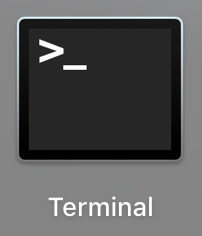 | 	| 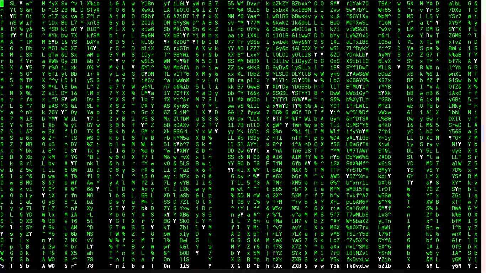 |  |
|:-:|:-:|:-:|:-:|
|Esta es una terminal| Esta también es una terminal| Esto es la matrix, se hacen cosas parecidas en bioinformática, así que consideremos esta una terminal también| Esto es un ramsomware, el virus que atacó a Movistar hace unos días, hecho para windows, esto **no** es una terminal.|

Una terminal es un intérprete de comandos fundamental en los sistemas operativos para la interacción con el usuario, ya que, se escriben comandos y acciones en él. Realizar acciones seguidas en una terminal también es considerado programar, en cierta forma podemos ser hackers. En este practico solo nos concentraremos en las terminales basadas en Unix (Linux o Mac, los siento Windows esta vez no).

## ¿Qué puedo hacer con la terminal?
Prácticamente todo lo que hace un computador, con una terminal tu ordenas lo que quieres y el computador lo hará, lo difícil es transmitir lo que realmente pensamos a la terminal.

## Primeras ordenes
Cuando se aprende un nuevo lenguaje de programación, lo tradicional es hacer que el computador nos diga "Hola Mundo" en dicho lenguaje de programación. Así que el primer paso abrir una terminal como esta:
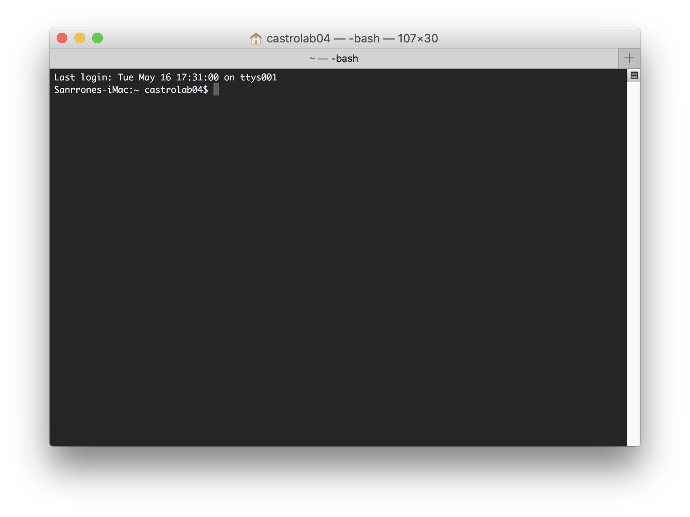
ahora usaremos el comando "echo" para que la terminal nos diga lo que queremos así que escribiremos: echo "Hola Mundo" y presionamos enter.
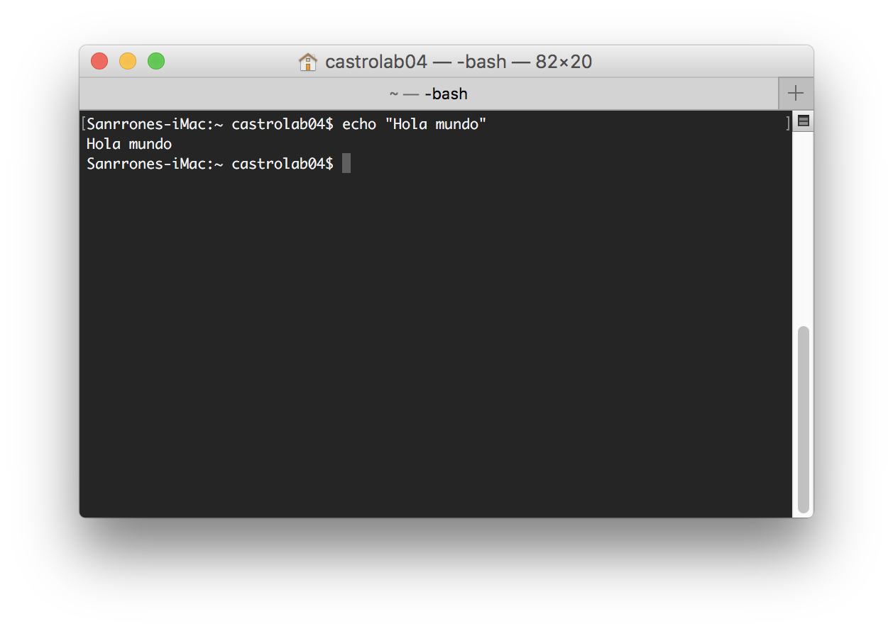
En realidad podemos decirle al computador que nos diga cualquier cosa con el comando echo, recuerda que cada vez que ingresas un comando o acción debes presionar enter.
## Variables
En la terminal podemos asignar frases completas (o números), a variables, y no nos referimos a variables matemáticas X e Y (podemos hacerlo, pero no es entretenido). **recuerda siempre poner tus variables dentro de comillas dobles**
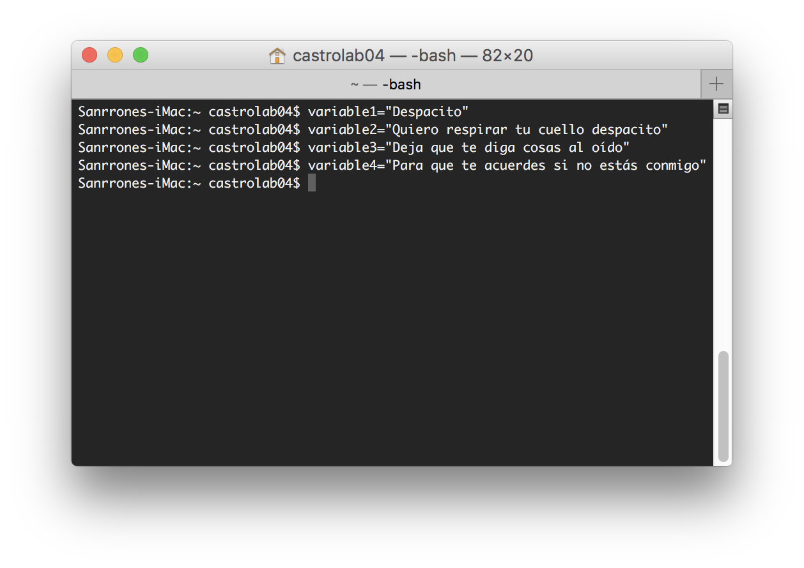
y ahora en la misma terminal, podemos decirle al computador que nos muestre los párrafos con el comando echo y darle las variables como parámetro. **Cuando queremos hacer referencia a una variable la escribimos anteponiendo un "$"**: 

	echo $variable1, $variable2, $variable3, $variable4
	Despacito, Quiero respirar tu cuello despacito, Deja que te diga cosas al oído, Para que te acuerdes si no estás conmigo
	
## Manejando directorios
La terminal no solo sirve para realizar operaciones como una calculadora o hacer que escriba una canción, también es frecuentemente usado para manipular directorios, el primer paso en el uso de estos, es la creación de una carpeta, para ello el comando a usar se llama **mkdir**:

	mkdir dia1
	esto creará una carpeta llamada dia1

Para entrar a nuestra carpeta recién creada, usaremos el comando **cd**:

	cd dia1

Solo con esto se siente un poco vacío lo que hacemos, y en realidad podría necesitar un poco mas de información acerca de la "ruta completa", para ello usaremos el comando **pwd**

	pwd
	/Users/castrolab04/Desktop/Workshop-PUC/dia1
	esto es una ruta completa, nosotros estamos posicionados en la última carpeta llamada dia1 (cada / separa una carpeta dentro de otra).
	No te preocupes si no se muestra la misma ruta, de hecho, es probable que la ruta sea única para cada computador.
	
ya sabemos donde estamos en nuestra terminal, ahora listemos los archivos en la carpeta usando el comando **ls**:

	ls
	Dia1_introduccion.md
	
	si nuestra carpeta esta vacía, no mostrará nada, de lo contrario mostrara todos los archivos y carpetas que estén allí.
	si queremos ver los archivos con más información podemos agregar parámetros a ls como lo son -lh (long format in human readble format)
	
	ls -lh
	total 1
	-rw-r--r--  1 castrolab04  staff    12K May 17 11:49 Dia1_introduccion.md

	las primeras lineas y guiones hacen referencia a los permisos que tiene el archivo sobre el sistema (no nos preocuparemos de eso)
	1 castrolab04 staff es la cantidad de usuarios y grupos (y los usuarios), que pueden acceder al archivo
	12K es el peso del archivo
	May 17 11:49, es la fecha y hora en la que creado o modificado el archivo por última vez.
	
También en nuestra terminal podemos movernos entre esas carpetas y listar su contenido, para ello usaremos el comando **cd**,**ls** y **pwd**:

	pwd
	/Users/castrolab04/Desktop/Workshop-PUC/dia1
	cd ..
	en este caso escribimos .. para volver a una carpeta anterior.
	pwd
	/Users/castrolab04/Desktop/Workshop-PUC
	ls
	LICENSE		dia1		dia3
	README.md	dia2		images
	
	y podemos seguir retrocediendo en nuestras carpetas
	cd ..
	pwd
	/Users/castrolab04/Desktop
	
	y para entrar a una carpeta, solo le damos el nombre de la carpeta (o ruta), al comando cd
	cd Workshop-PUC/dia1

Puedes encontrar una lista detallada de los comandos básicos mas usados en la terminal [aquí](https://github.com/microgenomics/Workshop-PUC/blob/master/dia1/GuiaComandosBasicosTerminal.md)

## Manejo de archivos de texto

Un archivo de texto se define como un archivo que contiene caracteres sin algún patron en específico, existen varias formas de crear un archivo una de ellas es **redireccionando la salida de los comandos**, esto parece ser complejo pero no lo es tanto. Recuerdan nuestras variables: variable1, variable2, variable3 y variable4.

	echo $variable1, $variable2, $variable3, $variable4
	Despacito, Quiero respirar tu cuello despacito, Deja que te diga cosas al oído, Para que te acuerdes si no estás conmigo
	
Podemos redireccionar el resultado (o salida en la jerga programática), para que en vez de ser imprimido en la pantalla, sea guardado en un archivo, para ello agregamos ">" seguido de algún nombre para nuestro archivo.

	pwd
	/Users/castrolab04/Desktop/Workshop-PUC/dia1
	echo $variable1, $variable2, $variable3, $variable4 > despacito.txt
	
	ls
	Dia1_introduccion.md	despacito.txt
	
	si queremos agregar lineas adicionales al archivo, simplemente agregamos >>
	echo "Dime dime dime si tu quieres andar conmigo" >> despacito.txt
	
	si el archivo no esta creado, lo creará
	y si existe, las lineas se agregaran al final del archivo
	
Así tenemos nuestro archivo creado y ya no tenemos que escribir las variables otra vez en caso que cerremos la terminal o apaguemos el computador. ¿Ahora que pasa si queremos mover el archivo de ubicación? Para esto existe el comando **mv**

	imaginemos que queremos mover el archivo despacito.txt, a la carpeta anterior de la que estamos.
	La sintaxis es: [comando] [archivo a mover] [ruta de destino]
	
	mv despacito.txt ../
	
	y si queremos recuperar el archivo, hacemos el movimiento inverso
	mv ../despacito.txt .
	
	aquí el punto significa "ruta actual", así es un tanto fácil recordar:
	.. = ruta anterior
	.  = ruta actual
	
	así el comando se interpretaría como: mover ruta_anterior/despacito.txt hacia_ruta_actual
	
Otra parte muy util de la terminal es la búsqueda de palabras en un archivo, de esta forma evitas abrir un archivo que pueda tener muchos GB de información. El comando encargado de esto es **grep**

	grep "quieres" despacito.txt
	Dime dime dime si tu quieres andar conmigo

	el comando grep entrega la línea entera donde se encuentra el patron de búsqueda.

Muy bien!, pero ha llegado la hora de decir adios a nuestro archivo. Para ello usaremos el comando **rm** (ten cuidado con este comando, ya que todo lo que toca lo desaparece).

	rm despacito.txt
	(el comando rm no retorna mensajes a menos que sea alguno relacionado con no poder eliminar el archivo).
	ls
	Dia1_introduccion.md

Puede que resulten ser muchos comandos en un principio, pero solo la práctica hará que puedas dominarlos, y un dato curioso, **existen mas de 200 comandos** disponibles en tu computadora, y los usaremos **TODOS**.................................................es una broma, solo usaremos algunos como los ya vistos pero de forma mas integrativa.

Nota: Eventualmente se nos olvidarán como funcionan algunos comandos, pero cada uno tiene un manual, **man** es el comando que convoca a los manuales de los comandos:

	man ls
		S(1)                     BSD General Commands Manual                    LS(1)
	
	NAME
	     ls -- list directory contents
	
	SYNOPSIS
	     ls [-ABCFGHLOPRSTUW@abcdefghiklmnopqrstuwx1] [file ...]
	
	DESCRIPTION
	     For each operand that names a file of a type other than directory, ls
	     displays its name as well as any requested, associated information.  For
	     each operand that names a file of type directory, ls displays the names
	     of files contained within that directory, as well as any requested, asso-
	     ciated information.
	
	     If no operands are given, the contents of the current directory are dis-
	     played.  If more than one operand is given, non-directory operands are
	     displayed first; directory and non-directory operands are sorted sepa-
	     rately and in lexicographical order.
	     
Presiona "q" para salir

¿Conoces el archivo fasta?, es el formato por excelencia para guardar secuencias de ADN, ARN o Proteínas, tiene el siguiente formato:

	>header o identificador, suele tener información concisa acerca de la secuencia
	GCAAGCGGCTAGCTAGCTACTACCAGCGATCACGAGCATCGATCGATGCT
	GTCGTCGAGTCGTAGCTATATTGCGAGCAGAAATATATATTATATATATA
	GCGCGCGCGCGCGCGCGCGCGGGGGGGGGGGGGGGCCCCCCCCCCCCCCC
	GCAAGCGGCTAGCTAGCTACTACCAGCGATCACGAGCATCGATCGATGCT
	GTCGTCGAGTCGTAGCTATATTGCGAGCAGAAATATATATTATATATATA
	GCGCGCGCGCGCGCGCGCGCGGGGGGGGGGGGGGGCCCCCCCCCCCCCCC
	
creemos nuestro propio fasta!

	primero crearemos el archivo 1.fasta solo con el header del archivo
	echo ">mi_secuencia" > 1.fasta
	ahora agregaremos una secuencia al final del archivo
	echo "GCAAGCGGCTAGCTAGCTACTACCAGCGATCACGAGCATCGATCGATGCT" >> 1.fasta
	y podemos agregar otra secuencia al final.
	echo "GTCGTCGAGTCGTAGCTATATTGCGAGCAGAAATATATATTATATATATA" >> 1.fasta
	y otra
	echo "GCGCGCGCGCGCGCGCGCGCGGGGGGGGGGGGGGGCCCCCCCCCCCCCCC" >> 1.fasta
	
ahora veamos nuestro archivo por la terminal!, usaremos el comando **cat**:

	cat 1.fasta
	>mi_secuencia
	GCAAGCGGCTAGCTAGCTACTACCAGCGATCACGAGCATCGATCGATGCT
	GTCGTCGAGTCGTAGCTATATTGCGAGCAGAAATATATATTATATATATA
	GCGCGCGCGCGCGCGCGCGCGGGGGGGGGGGGGGGCCCCCCCCCCCCCCC
	
	Felicidades!, hemos hecho un archivo fasta
	
	repitamos el proceso pero el fasta deberá llamarse test.fasta
	
	echo ">mi_secuencia_2" > test.fasta
	echo "PKCKPAEECKELAPCKAELKCKLEAPLKECKLAKCLAPEKCLPP" >> test.fasta
	
	Listo!
	
Si rápidamente queremos buscar algún patron en el fasta por ejemplo una pequeña secuencia "CGAT" podemos usar el comando grep:

	grep -n "CGAT" 1.fasta
	2:GCAAGCGGCTAGCTAGCTACTACCAGCGATCACGAGCATCGATCGATGCT
	
	su sintaxis humana sería: [comando + opciones] [patrón] [donde buscar patrón]

Donde:

* grep es el comando para buscar patrones
* -n es un parámetro de grep para indicar en que número de linea encuentra el match
* "CGAT" es el patron para buscar
* 1.fasta es el archivo donde se buscara el patrón

## Wildcard o Expresiones regulares
Las wildcard o expresiones regulares, son símbolos que representan patrones, nos ayuda a aumentar nuestro umbral de match cuando queremos buscar algo. Por ejemplo, ¿que pasa si dentro de una carpeta con 100 archivos, solo queremos mostrar aquellos cuyo nombre empieza con algún número? esto se resolvería con 2 wildcard:
 
 * [0-9] esta wildcard significa "todos los números enteros entre 0 y 9", también puede escribirse así: [0123456789]
 * \* esta wildcard significa "todo"

Combinadas serian "[0-9]*" y se interpretaría como, "todo lo que empieza entre 0 y 9, seguido de cualquier cosa". y Listo, tenemos nuestra wildcard, ahora solo tenemos que escoger el comando de acuerdo a nuestras necesidades.

Como queremos "mostrar" archivos, el comando correspondería a **ls** pero aplicando la wildcard

	ls [0-9]*
	1.fasta
	
	ahora solo nos muestra los archivos de acuerdo a la wildcard.
	también, si no recuerdas el nombre de un archivo pero tienes alguna idea, puedes usar las wildcard para encontrarlo
	
	ls t*
	test.fasta
	
	también podemos duplicar un archivo con el comando cp
	cp 1.fasta 2.fasta
	
	sintaxis: [copiar] [lo que quiero copiar] [nombre destino]
	
Recuerdas el comando **cat**? se usa para mostrar el contenido de un archivo en la terminal, y podemos usarlo también para combinar 2 archivos fasta y obtener nuestro primer multi-fasta.

	cat 1.fasta 2.fasta	> 3.fasta
	cat 3.fasta
	>mi_secuencia
	GCAAGCGGCTAGCTAGCTACTACCAGCGATCACGAGCATCGATCGATGCT
	GTCGTCGAGTCGTAGCTATATTGCGAGCAGAAATATATATTATATATATA
	GCGCGCGCGCGCGCGCGCGCGGGGGGGGGGGGGGGCCCCCCCCCCCCCCC
	>mi_secuencia
	GCAAGCGGCTAGCTAGCTACTACCAGCGATCACGAGCATCGATCGATGCT
	GTCGTCGAGTCGTAGCTATATTGCGAGCAGAAATATATATTATATATATA
	GCGCGCGCGCGCGCGCGCGCGGGGGGGGGGGGGGGCCCCCCCCCCCCCCC
	
Podemos usar las expresiones regulares con el comando **grep** para buscar algún patron (una caja TATA tal vez?), en varios archivos a la vez:

	grep -n "TATA" *.fasta
	1.fasta:3:GTCGTCGAGTCGTAGCTATATTGCGAGCAGAAATATATATTATATATATA
	2.fasta:3:GTCGTCGAGTCGTAGCTATATTGCGAGCAGAAATATATATTATATATATA
	3.fasta:3:GTCGTCGAGTCGTAGCTATATTGCGAGCAGAAATATATATTATATATATA
	3.fasta:7:GTCGTCGAGTCGTAGCTATATTGCGAGCAGAAATATATATTATATATATA
	
	esto nos muestra en cada archivo, en cada numero de línea el match que buscamos. 
	Al buscar archivos con "*" estamos diciendo al comando grep que busque en todo lo que termine con .fasta

Quizás puede servirnos solo contar el numero de match de nuestra secuencia, aquí el comando a utilizar es **wc** (word count):

	grep -n "TATA" *.fasta |wc -l
	4

Usar `|` está dentro de la categoría de redireccionar al igual que `>`. `|` permite usar la salida del primer comando como entrada para el siguiente, en este caso el resultado anterior es tomado por **wc** que cuenta los caracteres y con el parámetro `-l` solo las líneas.
	
	
## Crea tu propio script
Un script es un pequeño archivo con comandos que lee la terminal y las ejecuta en orden desde arriba hacia abajo. Es muy parecido a una receta de cocina. Es más, cocinemos un archivo fastq!

fastq es un archivo de text que tiene un formato en particular similar al fasta (también guarda secuencias), con la diferencia que un fastq también guarda calidades de la secuencia y tiene el siguiente formato:

	@SEQ_ID
	GATTTGGGGTTCAAAGCAGTATCGATCAAATAGTAAATCCATTTGTTCAACTCACAGTTT
	+
	!''*((((***+))%%%++)(%%%%).1***-+*''))**55CCF>>>>>>CCCCCCC65
	
* La primera linea es el header del fastq y siempre empieza con un @
* La segunda linea es la secuencia, igual que un archivo fasta
* la tercera linea es un "+" para (opcionalmente), poner descripciones de la secuencia
* La ultima linea corresponde a las calidades de cada nucleótido, cada símbolo representa un número y por ende una calidad (usado por ejemplo cuando se manda a secuenciar un organismo, las secuencias llegan en este formato). Para ver que número equivale cada símbolo sigue [este enlace](http://ascii.cl)

Aquí les presentamos un comando para editar (o crear), un archivo: **vi**.

	vi miscript.sh
	(.sh es solo una extensión genérica para indicar que adentro hay (o habrá), código shell (sh).

Se nos abrirá una terminal con nada de contenido y en negro (o blanco, dependiendo de tu terminal), si el archivo miscript.bash existe, entonces se abrirá y podremos modificarlo, de lo contrario se creará.

Para **insertar** texto debemos apretar la letra **i**, con ello todo lo que tecleemos estará en el archivo, y como hemos aprendido un par de comandos, haremos nuestra receta de cocina escribiendo:

	echo "@mi_primer_fastq"
	echo "ATGTTGCAACGATTGGTCGTTGCATTATGCCTGCTTGGGT"
	echo "+"
	echo "CCCCCCC65++)(%%%%).1!''*((((>>>>>()()()>"

Para guardar, presionamos **Escape**, para salir del modo **insertar**, y escribimos "**:wq**" y presionamos Enter.
 
* ":" es para indicar que queremos una acción especial de **vi**
* w es para indicar a **vi** que guarde los cambios.
* q es para indicar que saldremos del editor

Todo esto debiera verse así:
 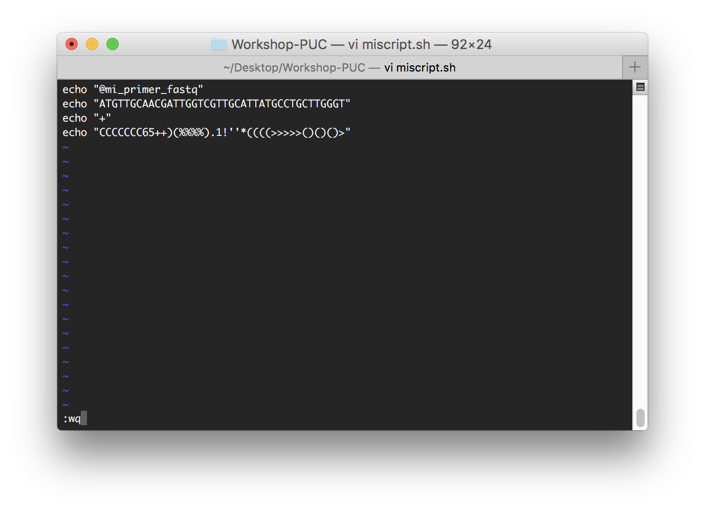
 
 Y ahora ejecutamos nuestro script usando el comando **bash**: 
 
 	bash miscript.sh
 	@mi_primer_fastq
	ATGTTGCAACGATTGGTCGTTGCATTATGCCTGCTTGGGT
	+
	CCCCCCC65++)(%%%%).1!''*((((>>>>>()()()>
	
	podemos redireccionar la salida de un script
	bash miscript.sh > miprimer.fastq
	
Cuando se trabaja en bioinformática, es normal que los archivos fasta o fastq sean muy grandes, con muchas secuencias y que ocupen muchos Gigas de espacio. Por eso no es descabellado pensar que podemos reducir su tamaño (y no nos referimos a botar a la basura la mitad de las secuencias), nos referimos a **comprimir** y usaremos el comando **gzip**:

	en nuestro tendríamos que escribir:
	gzip 1.fasta
	gzip 2.fasta
	gzip 3.fasta
	gzip test.fasta
	gzip miprimer.fastq
	
Esto se volvería imposible de hacer si tenemos 1000 fastas, por eso es mejor usar un **ciclo for**. La estructura de un **for** es:

	for variable in $(comando)
	do
		comandos, scripts o recetas de cocina
	done
	
en nuestro caso sería

	for mi_archivo in $(ls *.fast[aq])
	do
		gzip $mi_archivo
	done
	
	ls *.fast[aq]
	1.fasta.gz	2.fasta.gz	3.fasta.gz	test.fasta.gz	miprimer.fastq.gz

En este caso la sintaxis del ciclo **for** la acompañamos de una expresión regular donde apuntamos a "todo (`*`) lo que termine con `.fast` y además el último carácter debe terminar en `a` o `q`". El resultado de esta expresión regular es tomado por **ls** y luego por el ciclo **for**, agregandose a una variable (la misma variable se renueva con otro valor en cada "vuelta").

## Aplicando todo
Primero descarga y descomprime este pequeño set de secuencias [aquí](https://github.com/microgenomics/Workshop-PUC/blob/master/dia1/problem1.zip). Tenemos el siguiente caso: Han llegado secuencias de personas enfermas con asma  y personas sanas, el ADN fue secuenciado con tecnología Next-Gen y en formato fastq, y nuestro jefe quiere rápidamente unas estadísticas iniciales, como el número de secuencias, cuanto pesan los archivos y mostrar estos resultados para cada muestra en un archivo llamado reporte.txt.

Primero entramos en la carpeta descomprimida

	cd problema1

podemos empezar escribiendo el reporte con un título y guardarlo mientras en el archivo requerido.

	echo "Estadísticas iniciales" > reporte.txt
	
listamos el directorio para saber cuantos archivos hay
	
	ls
	muestra1.fastq	muestra3.fastq	muestra5.fastq	muestra7.fastq
	muestra2.fastq	muestra4.fastq	muestra6.fastq
	
aquí podemos de inmediato responder la pregunta de cuanto pesan los 
archivos tan solo agregando el parámetro antes usado -lh

	ls -lh
	-rw-r--r--  1 castrolab04  staff   3.4K May 17 18:31 muestra1.fastq
	-rw-r--r--  1 castrolab04  staff   4.6K May 17 18:31 muestra2.fastq
	-rw-r--r--  1 castrolab04  staff   8.9K May 17 18:32 muestra3.fastq
	-rw-r--r--  1 castrolab04  staff   4.7K May 17 18:32 muestra4.fastq
	-rw-r--r--  1 castrolab04  staff   6.8K May 17 18:32 muestra5.fastq
	-rw-r--r--  1 castrolab04  staff   6.4K May 17 18:33 muestra6.fastq
	-rw-r--r--  1 castrolab04  staff   5.0K May 17 18:33 muestra7.fastq

y esto podemos guardarlo mientras en nuestro archivo reporte .txt

	echo "Peso de los archivos" >> reporte.txt
	ls -lh *.fastq >> reporte.txt
	
para resolver la petición de saber cuantas secuencias existen, recuerden que existe el comando **wc -l**

	echo "Cantidad de secuencias" >> reporte.txt
	wc -l muestra1.fastq
	40 muestra1.fastq
	
	en este caso son 40 líneas en el fastq, pero recordemos que en realidad un fastq contiene 1 secuencia cada 4 líneas.
	Así que para obtener el número real, debemos dividir el número de wc en 4. 
	La forma mas rápida es con un pequeño truco en "awk"
	
	wc -l muestra1.fastq |awk '{print $1/4, $2}'
	40
	
ahora veamos que significa este nuevo truco (ya un poco más avanzado), llamado awk: todo código awk puesto en la terminal va encerrado entre comillas simples y en bloques de llaves `'{}'`. `print` es una función de awk para imprimir en pantalla la variable que este al lado de la función, en este caso `$1/4`, que a su vez `$1` significa **columna 1**, y como sabemos que la primera columna es el número que entrega **wc -l** lo dividimos por 4 (`/4`), por ultimo `, $2` significa que habrá un espacio e imprimirá la columna 2 (el nombre de la muestra), resultando así en `'{$1/4, $2}'`.

Ahora bien, resultaría un poco tedioso hacer este comando 7 veces (incluso hay proyectos con mas de 700 muestras), por lo que haremos uso del ciclo para calcular el número de secuencias.

	Recuerden que para acceder al valor de una variable se antepone "$"
	for mifastq in $(ls *.fastq)
	do
		wc -l $mifastq |awk '{print $1/4, $2}'
	done
	
	10 muestra1.fastq
	12 muestra2.fastq
	20 muestra3.fastq
	11 muestra4.fastq
	15 muestra5.fastq
	15 muestra6.fastq
	10 muestra7.fastq

y guardamos este resultado en reporte.txt

	for mifastq in $(ls *.fastq)
	do
		wc -l $mifastq |awk '{print $1/4, $2}'
	done >> reporte.txt
	
Y listo! podemos ver el resultado mostrando el reporte con el comando **cat**
	
	cat reporte.txt
	Estadísticas iniciales
	Peso de los archivos
	-rw-r--r--  1 castrolab04  staff   3.5K May 17 18:47 muestra1.fastq
	-rw-r--r--  1 castrolab04  staff   4.6K May 17 18:31 muestra2.fastq
	-rw-r--r--  1 castrolab04  staff   8.9K May 17 18:32 muestra3.fastq
	-rw-r--r--  1 castrolab04  staff   4.7K May 17 18:32 muestra4.fastq
	-rw-r--r--  1 castrolab04  staff   6.8K May 17 18:32 muestra5.fastq
	-rw-r--r--  1 castrolab04  staff   6.4K May 17 18:33 muestra6.fastq
	-rw-r--r--  1 castrolab04  staff   5.0K May 17 18:33 muestra7.fastq
	Cantidad de secuencias
	10 muestra1.fastq
	12 muestra2.fastq
	20 muestra3.fastq
	11 muestra4.fastq
	15 muestra5.fastq
	15 muestra6.fastq
	10 muestra7.fastq
		
Y listo!, ya podemos enviar el reporte a nuestro jefe, por mientras, seguiremos con el tutorial pero ahora desde una perspectiva desde el código de R. No olviden salir de la carpeta para continuar el tutorial
	
	cd ..

## R: ¿Qué es?
R es un lenguaje de programación para cálculos estadísticos y gráficos  basado en el lenguaje S creado en los laboratorios Bell (Lucent Technologies). Muy popular en la ciencia debido a sus gráficos de alta calidad y versatilidad al momento de mostrar lo que se tiene en mente.

## Instalación

Para **MacOS**:

descarga el archivo de instalación [aquí](https://cloud.r-project.org/bin/macosx/R-3.4.0.pkg), luego haz doble-click en el archivo y sigue los pasos de la instalación.
	
Para **Linux**:

	sudo apt-get update
	sudo apt-get install r-base
	sudo apt-get install r-base-dev
	
Bingo!, ya tenemos R instalado veamos que tal es, abramos una terminal, escribimos `R` y presionamos enter

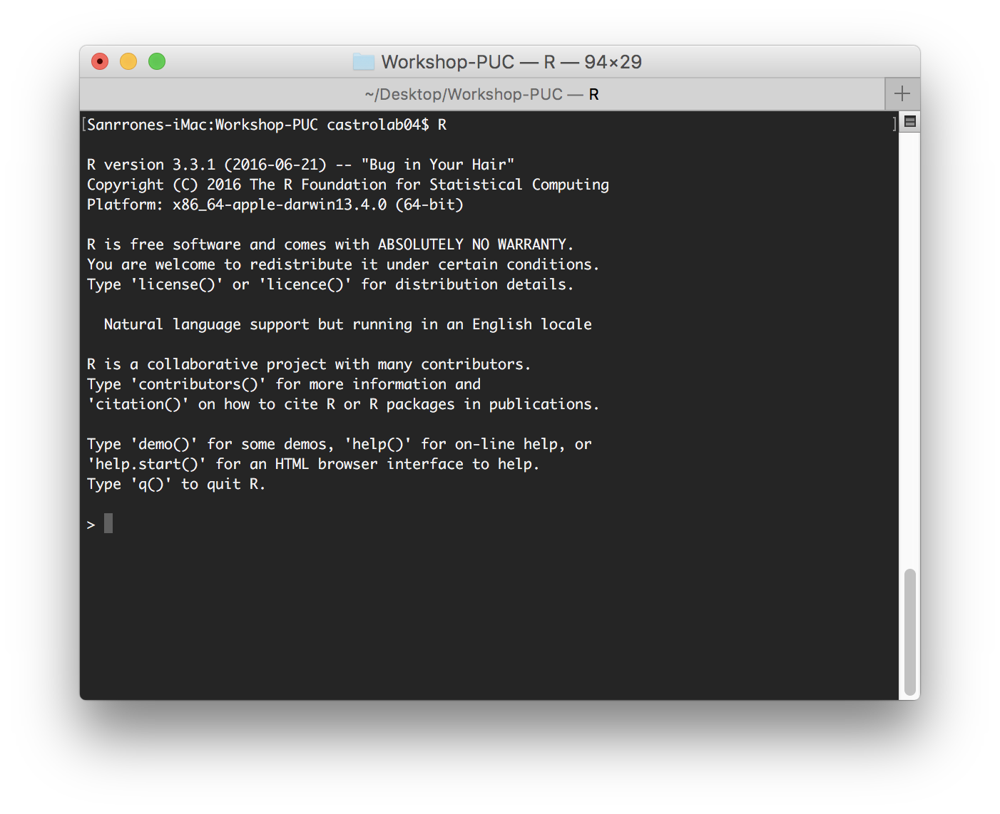

La verdad es bastante poco amigable el código en si. ya tiene sus complicaciones manejar una shell como para manejar una shell dentro de otra shell. Es por esto que les presentamos **RStudio**

para **MacOS**:

Descarga el archivo de instalación [aquí](https://download1.rstudio.org/RStudio-1.0.143.dmg), después haz doble click en el archivo descargado arrastra el icono de RStudio a la carpeta Aplicaciones que sale al lado.

para **Linux (Ubuntu/Bioubuntu/Debian)**:

Descarga el archivo de instalación [aquí](https://download1.rstudio.org/rstudio-1.0.143-amd64.deb), luego haz doble click en el archivo descargado y sigue las instrucciones de instalación.

Luego abrimos RStudio y listo!, una interfaz gráfica mucho mas amigable que una terminal.

## Las 4 zonas

* **Editor de texto**: en esta zona es donde ocurre la magia, donde pondremos el código e iremos preparando nuestros scripts. Podemos ejecutar nuestro código aprentando el botón `Run`, o ejecutando la linea que queremos ejecutar con ctrl (o command en el caso de mac) + enter
* **Consola**: las acciones que escribimos en el editor de texto se ejecutan en esta ventana, aquí aparecen los resultados excepto los gráficos. También puedes escribir el código directamente aquí.
* **Historial y ambiente**: en esta ventana las variables que creemos serán guardadas y mostradas aquí, ademas de estar disponibles en caso que hagamos mas de un script.
* **Archivos, gráficos, paquetes, ayuda y visualizador (AGPAV)**: esta ventana se divide a su vez en otras 5 pestañas que son de mucha utilidad:
	* **Files**: aquí se muestran los archivos de nuestro `work directory`, generalmente el `HOME`
	* **Plots**: en esta ventana se muestran nuestros gráficos.
	* **Packages**: muestra una lista con los paquetes, instalados además de poder instalar otros.
	* **Help**: es una ventana de ayuda cuando queremos obtener información de alguna librería en especial o una función desconocida.
	* **Viewer**: Es solo un panel de visualización para casos (por ejemplo), de conexiones remotas, no lo tomaremos en cuenta.

## Paquetes
Un paquete en R, es una colección de funciones agrupados y que cumplen con un formato específico. Cada vez que instalamos R, un número finito de funciones viene con ello, suficientes para otorgar estabilidad al entorno.

Si apretamos en la pestaña Packages en la ventana de AGPAV, obtendremos una lista de los paquetes instalados y de aquellos que están "activados"
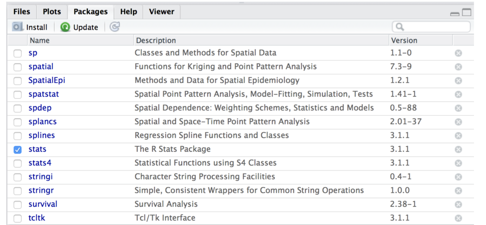
También existe una gran librería donde podemos descargar mas paquetes de acuerdo a nuestras necesidades. Por ejemplo, uno de los paquetes mas usados es **ggplot2**, un paquete usado para graficar todo tipo de datos en distintos tipos de formatos. Para instalarlo presionamos el botón `Install` que esta en la pestaña Packages de la ventana AGPAV.

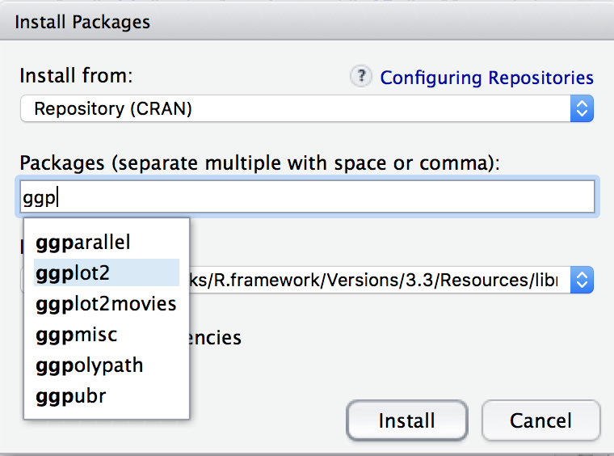

seleccionamos **ggplot2** y presionamos install, esperamos un poco y listo!. De esta forma se instalan los paquetes de R.

Aprovechemos e instalemos un paquete usaremos mas adelante, se trata del paquete ape, usado para análisis filogenéticos y que contiene funciones de lectura de archivos fasta. Así que otra vez para instalarlo presionamos el botón `Install` que esta en la pestaña Packages de la ventana AGPAV.

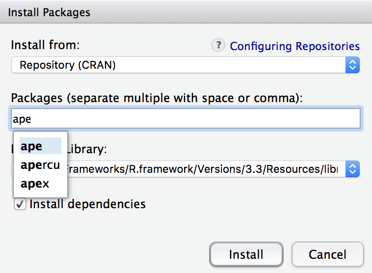

En estos casos existe una gran biblioteca de paquetes (librería), donde se alojan para ser descargados, esta librería se llama CRAN. 

Existe otra librería llamada `Bioconductor` (www.bioconductor.org) el cual es una serie de paquetes de R que han sido especialmente desarrollados para bioinformática. Aunque no existe una interfaz gráfica para instalar paquetes como CRAN, `bioconductor` ofrece 2 simples lineas de código para instalar cualquier paquete de esta librería. Por ejemplo, instalemos el paquete `phyloseq`

	source("https://bioconductor.org/biocLite.R")
	biocLite("phyloseq")
	library(phyloseq)
	library(ggplot2)

## Operaciones básicas
R tiene la capacidad de interpretar de forma mas intuitiva que una shell, por ejemplo, escribamos en la consola:
	
	x<-1
	
esto significa que el `x` tomara el valor `<-` de `1`. Esto por si solo no nos devolverá valor alguno. Si escribimos
	
	x
	[1] 1
ahora el sistema devuelve el valor de `1`, esto es por que solo estamos asignando un valor y no estamos pidiendo a R que muestre valor, para eso es la segunda linea. No nos preocupemos por el 1 encerrado en corchetes `[1]` solo es el numero de lineas de nuestro output.

R puede funcionar como una calculadora.
	
	x + 1
	[1] 2
	x - 1
	[1] 0
	x<- x + 1
	x
	[1] 2
	x<-x*x
	[1] 4
	log(10)
	[1] 2.302585

Una de las utilidades básicas mas usadas en R es la lectura de archivos (tablas como tsv o csv). Por ejemplo, descarga y descomprime [este archivo](https://github.com/microgenomics/Workshop-PUC/blob/master/dia1/taxcount.csv.zip). Es un archivo CSV que contiene información acerca de bacterias en personas con asma y personas sanas y la abundancia en que estas bacterias se encuentran.

antes de leer el archivo con R, primero debes establecer nuestro directorio de trabajo, esto se hace con la función **setwd()**:

	y estableceremos la ruta en nuestra carpeta actual dia1
	/Users/castrolab04/Desktop/Workshop-PUC/dia1 (esta ruta cambia de PC en PC, debes encontrar tu propia ruta)
	si no sabes como obtener la ruta completa, recuerda que existe el comando pwd que puedes usar en una terminal y copiar desde allí la ruta completa.
	setwd("/Users/castrolab04/Desktop/Workshop-PUC/dia1")
	
listo!, ahora que establecimos nuestro working directory, ya podemos leer nuestro archivo taxcount.csv, para eso usaremos la función **read.csv** de R.

	df<-read.csv(file.choose(),header = TRUE)
	
* df es la variable donde guardaremos nuestro CSV
* read.csv() es la función para leer el CSV
* cada función necesita parámetros (inputs) para trabajar, en este caso son file.choose() (el nombre de una función que nos dejará escoger un archivo y seleccionamos taxcount.csv), y header=TRUE que significa que nuestra tabla taxcount.csv tiene encabezados dentro aparte de los datos.

ahora la nuestra tabla esta guardada en la variable `df`, y tiene mas de 1000 filas con información, por eso, para no mostrar todas líneas usaremos la función **head()**

**Nota: escribimos las funciones con () porque se da a entender que reciben datos para funcionar**

	head(df)
	 Kingdom         Phylum          Class             Order             Family           Genus                        Species                           Name SRR1528344 SRR1528346 SRR1528348 SRR1528420 SRR1528426 SRR1528430 SRR1528434 SRR1528456 SRR1528458 SRR1528460 SRR1528462 SRR1528464 SRR1528466 SRR1528468
	1 Bacteria Actinobacteria Actinobacteria Corynebacteriales Corynebacteriaceae Corynebacterium       Corynebacterium accolens       Corynebacterium accolens         12         23          3          9        205        592       2234          3       9973        422          1        154         14       3110
	2 Bacteria Actinobacteria Actinobacteria Corynebacteriales Corynebacteriaceae Corynebacterium    Corynebacterium afermentans    Corynebacterium afermentans          1          0          0          1          7          7         12          7          1          0          0          0          0          2
	3 Bacteria Actinobacteria Actinobacteria Corynebacteriales Corynebacteriaceae Corynebacterium   Corynebacterium ammoniagenes   Corynebacterium ammoniagenes          0          0          0          0          2          0          0          0          0          0          0          0          0          2
	4 Bacteria Actinobacteria Actinobacteria Corynebacteriales Corynebacteriaceae Corynebacterium     Corynebacterium amycolatum     Corynebacterium amycolatum          0          0          0          0          1          0          0          1          6          0          0          0          0          0
	5 Bacteria Actinobacteria Actinobacteria Corynebacteriales Corynebacteriaceae Corynebacterium Corynebacterium argentoratense Corynebacterium argentoratense          0          0          0          0          0          0          0          0          0          0          0          0          0          0
	6 Bacteria Actinobacteria Actinobacteria Corynebacteriales Corynebacteriaceae Corynebacterium    Corynebacterium aurimucosum    Corynebacterium aurimucosum          0          0          0          0          0          0          0         38          1          0          0          0          0          0

También podemos hacerlo manualmente especificando el nombre del archivo:

		df<-read.csv("taxcount.csv",header = TRUE)
		y es exactamente lo mismo
		
Exploremos un poco nuestros datos, para ver la cantidad de filas que tiene nuestro archivo usamos la función **nrow()** y para el numero de columnas **ncol()**

	nrow(df)
	[1] 1414
	ncol(df)
	[1] 21

Para obtener las últimas líneas de nuestros datos, ocupamos la función **tail()**

	tail(df)
	     Kingdom Phylum  Class  Order Family  Genus                    Species SRR1528344 SRR1528346 SRR1528348 SRR1528420 SRR1528426 SRR1528430 SRR1528434 SRR1528456 SRR1528458 SRR1528460 SRR1528462 SRR1528464 SRR1528466 SRR1528468
	1409  unknow unknow unknow unknow unknow unknow            naegleriophila           0          0          1          0          0          0          0          0          0          0          0          0          0          0
	1410  unknow unknow unknow unknow unknow unknow    Paraburkholderia kirkii          0          0          0          0          1          0          1          0          0          0          0          0          0          0
	1411  unknow unknow unknow unknow unknow unknow  Paracaedibacter symbiosus          0          0          0          0          0          0          0          0          0          0          0          0          0          0
	1412  unknow unknow unknow unknow unknow unknow        Solibacter usitatus          0          0          0          0          0          0          0          0          0          0          0          1          0          0
	1413  unknow unknow unknow unknow unknow unknow witches'-broom phytoplasma          0          0          0          0          0          0          0          0          0          0          0          0          0          0
	1414  unknow unknow unknow unknow unknow unknow        yellows phytoplasma          0          1          0          0          0          0          0          0          0          0          0          0          0          0
	
Para obtener el nombre de las columnas de nuestra tabla usamos la función **names()**

	names(df)
	[1] "Kingdom"    "Phylum"     "Class"      "Order"      "Family"     "Genus"      "Species"    "SRR1528344" "SRR1528346" "SRR1528348" "SRR1528420" "SRR1528426" "SRR1528430" "SRR1528434" "SRR1528456" "SRR1528458" "SRR1528460" "SRR1528462" "SRR1528464" "SRR1528466" "SRR1528468"
	
Una tabla a fin de cuentas es una matriz de AxB, y por tanto tiene coordenadas A e B, (o XY), de esta forma podemos acceder a algún dato en específico a nuestra tabla, la sintaxis es [FILA,COLUMNA], si llenamos con solo un valor, entonces se mostraran todos los valores del valor que no pusimos:

	df[2,]
	2 Bacteria Actinobacteria Actinobacteria Corynebacteriales Corynebacteriaceae Corynebacterium    Corynebacterium afermentans    Corynebacterium afermentans          1          0          0          1          7          7         12          7          1          0          0          0          0          2
	
La forma `[2,]` significa acceder a la fila 2 y todas las columnas. si dejamos vacío el lado izquierdo, y seleccionamos la columna 2, entonces mostraremos todas las filas de la columna 2 (no lo escribiremos en honor al espacio del tutorial, pero tu puedes hacerlo en tu RStudio.

Existen trucos bastante útiles cuando se quiere consultar las tablas, por ejemplo, ¿cuáles son las filas que tienen valores mayores a 1?. Intuitivamente uno tendería a escribir `df > 1` y en cierta medida funciona, pero existen columnas en nuestra tabla que no son numéricas,   por eso debemos limitar que columnas son las que serán sometida a dicha comparación, y sabemos que son desde la `8` a la `21` y lo rellenamos en la sección de columnas (lado derecho de la coma)

	rowSums(df[,8:21])>1
  
Esto retornará un montón de valores booleanos (TRUE y FALSE), con las posiciones de las filas que cumplen con nuestra condición. Este resultado podemos usarlo como índice para obtener los valores reales de la tabla y no solo los booleanos.
  
  	index <- rowSums(df[,8:21])>1
  	head(df[index,])
  	    Kingdom         Phylum          Class             Order             Family           Genus                              Species SRR1528344 SRR1528346 SRR1528348 SRR1528420 SRR1528426 SRR1528430 SRR1528434 SRR1528456 SRR1528458 SRR1528460 SRR1528462 SRR1528464 SRR1528466 SRR1528468
	1  Bacteria Actinobacteria Actinobacteria Corynebacteriales Corynebacteriaceae Corynebacterium             Corynebacterium accolens         12         23          3          9        205        592       2234          3       9973        422          1        154         14       3110
	22 Bacteria Actinobacteria Actinobacteria Corynebacteriales Corynebacteriaceae Corynebacterium Corynebacterium pseudodiphtheriticum          5       1391       5450        561         41        757        463        571        581         70          0         39         51      26161
	23 Bacteria Actinobacteria Actinobacteria Corynebacteriales Corynebacteriaceae Corynebacterium     Corynebacterium pseudogenitalium          3          7          1         13         51         19          2         12          9         26         68         27          8          7
	39 Bacteria Actinobacteria Actinobacteria Corynebacteriales Corynebacteriaceae       Turicella                   Turicella otitidis          2          1          1          0          1          0          0          0          0          0          0          0          0          0
	41 Bacteria Actinobacteria Actinobacteria Corynebacteriales        Dietziaceae         Dietzia                     Dietzia cinnamea          2          0          0          0          3          0          1          3          0          0          0          0          0          0
	60 Bacteria Actinobacteria Actinobacteria Corynebacteriales   Mycobacteriaceae   Mycobacterium               Mycobacterium gordonae          2          1          0          0          0          0          1          0          0          0          0          0          0          0
	
Encerramos el resultado en la función **head()** solo para mostrarte que ya no son correlativas las filas.

## Graficando la enfermedad
Graficar puede ser un dolor de cabeza muy prolongado en cualquier lenguaje de programación, es por esto que muchas funciones en R se han dedicado en lo posible a facilitar el trabajo del usuario para expresar lo que quiere al momento de generar gráficos.

¿Recuerdan la procedencia de la tabla anterior?, son de personas con asma y sanas. El objetivo es encontrar alguna relación de la enfermedad con el microbioma del/los individuos y graficar (en lo posible), esta relación con la ayuda del paquete `phyloseq`. Para esto primero descargaremos y descomprimiremos [esta tabla](https://github.com/microgenomics/Workshop-PUC/blob/master/dia1/metadata.csv.zip), la cual contiene la información fundamental acerca de que personas son las enfermas y las sanas.
	
Imaginen que phyloseq es un mueble con 3 cajonsitos, cada cajonsito tiene algo que guardar, en este caso phyloseq guarda 1) las taxonomías (tax_table) 2) las abundancias (otu_table) y 3)información de las personas (sample_data).

Por lo tanto construyamos la información para el primer cajon, las taxonomías:

	sabemos que el linaje esta en las primeras 7 columnas, por lo que extraeremos esas columnas.
	matriz<-as.matrix(df[,1:7])
	convocamos a la función as.matrix() para transformar nuestra tabla a un formato mas genérico que pueda leer el primer cajon de phyloseq
	finalmente transformamos nuestra variable matriz en formato tax_table de phyloseq
	tax<-tax_table(matriz)
	
Lo siguiente es formar el segundo formato phyloseq (otu_table), este formato esta compuesto solo por las abundancias de las bacterias, sabemos que estos valores se encuentran desde la columna 8 hasta la 21, por lo tanto extraeremos esos valores:
	
	al igual que en el ejemplo anterior, extraemos las columnas y las transformamos en un formato genérico leíble por las función otu_table
	matriz<-as.matrix(df[,8:21])
	y transformamos la tabla en el formato otu_table
	otu<-otu_table(matriz,taxa_are_rows = T)
	
Por último leemos el archivo con la información acerca de que personas están sanas o enfermas, de igual forma como leímos la tabla anterior:
	
	metad<-read.csv("metadata.csv",header = TRUE,row.names = 1)
	puedes usar file.choose() en vez de "metadata.csv" si tienes problemas para encontrar el archivo
	Ahora convertimos el archivo en formato sample_data
	metad<-sample_data(metad)
	simple no?
	
Finalmente ponemos los 3 cajones en su mueble correspondiente con la función **phyloseq()**

	phyob<-phyloseq(otu, tax,metad)

Listo!, ya tenemos nuestro objeto phyloseq, a graficar. Primero veamos que tal es la abundancia en cuanto al filo de las bacterias, esto lo haremos mediante la función **plot_bar()** y daremos como parámetro nuestro objeto (cajon) `phyob` creado anteriormente.

	plot_bar(phyob, fill = "Phylum")
	
Donde phyob es nuestro objeto phyloseq, y fill="Phylum" es una instrucción para la función plot_bar para que agrupe los datos por filo.
	
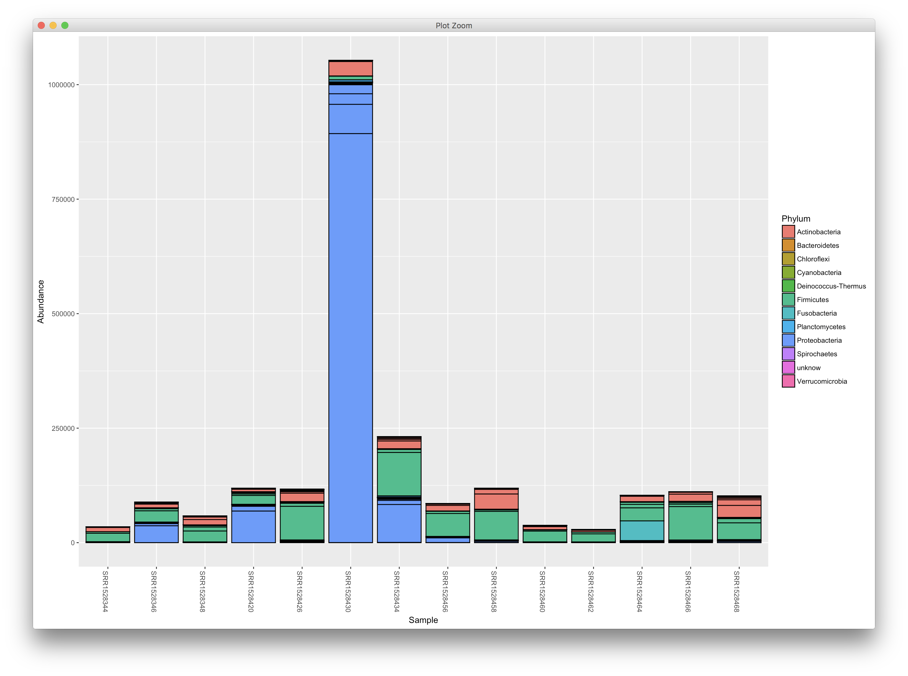

Nada mal no?, pero aun es pronto para establecer alguna relación entre la enfermedad y el microbioma, veamos que mas podemos hacer para elucidar esto.

Podemos graficar las abundancias separadas por condición, para esto escribimos:

	plot_bar(phyob, "Phylum",fill = "Phylum", facet_grid =~host_disease)
	
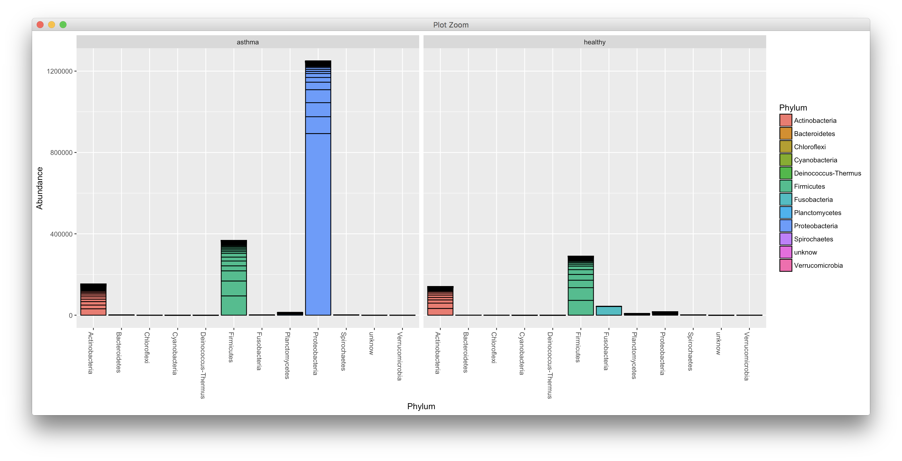

con esto ya podemos hacernos una idea quizás acerca de las proteobacterias que están mas presentes en las personas con asma. Pero aun es difícil concluir con certeza alguna relación. Necesitamos otro gráfico! jejeje. Esta vez uno llamado de co-ocurrencia, donde se podrá ver que relación establecen los organismos.

	ig<-make_network(phyob, distance="jaccard", type = "taxa")
	plot_network(ig, phyob, type = "taxa", color = "Phylum")

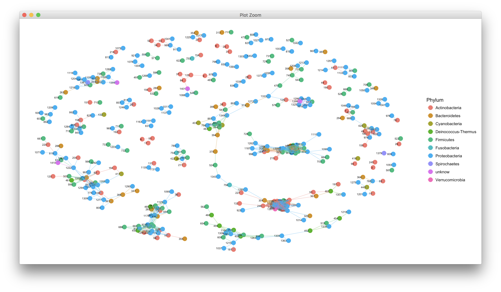
Al parecer las proteobacterias si influyen mucho en esta enfermedad. pero bueno, lamento decirte que son archivos de prueba con pacientes no reales. habría sido genial que esto fuera verdad.

Recuerda que las funciones tienen manuales, solo debes anteponer un `?` en la función que quieras obtener más información.

Ya que estamos familiarizado con los códigos y el mano de consolas (shell y R), estamos en condiciones de instalar programas fundamentales para el análisis de cualquier proyecto que tenga bioinformática como los que usaremos el día 2 y 3.

## Instalación de Requisitos
Existen 2 guías de instalación, una para los usuarios de **MacOS** y otra para usurarios de **Linux**.

Para los usuarios de Mac pinchen [este enlace](https://github.com/microgenomics/Workshop-PUC/blob/master/dia1/Guide_InstallPrograms_Linux.md)

Para los usuarios de Linux pinchen [este enlace](https://github.com/microgenomics/Workshop-PUC/blob/master/dia1/Guide_InstallPrograms_Mac.md)