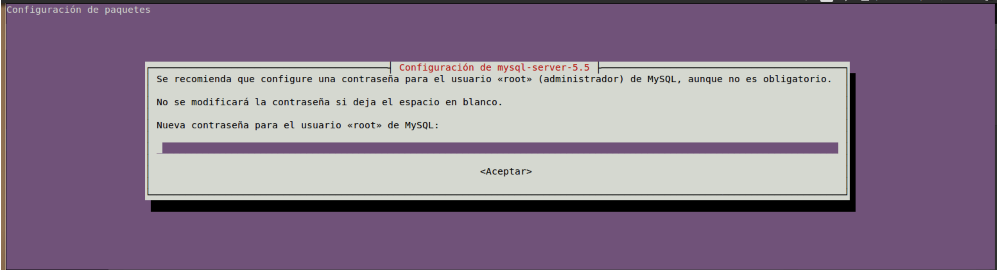

## Microbial Genomics Lab

[Katterinne Mendez](https://github.com/Katterinne) - [Sandro Valenzuela-Diaz](https://github.com/Sanrrone) - [Eduardo Castro-Nallar](https://github.com/ecastron)

---

> Workshop-PUC

# Instalación de Requisitos para Linux

**¡Bienvenidos!** Si tienes una computadora **Linux** y quieres hacer **Bioinformática**, estás en el tutorial indicado. A continuación los pasos a seguir para acondicionar tu PC con las configuraciones y programas básicos para correr programas bioinformáticos y poder analizar tus datos.

Esta guía está orientada a la instalación de requisitos necesarios para completar el trabajo práctico del **_workshop_** de "**Bioinformática: secuenciación masiva y genómica**".

---

### Lenguajes de Programación: Perl, Python y Java

La mayoría de los programas bioinformáticos están escritos en los lenguajes de programación `perl`, `python` y `java`. Necesitas tenerlos en tu computadora para que ésta pueda ejecutarlos.

Primero debes *checkear* si `perl`, `python` y `java` están operativos en tu computadora.

1.- Para *checkear* `perl`:

	# Abre la terminal y escribe:
	 perl --version
	This is perl 5, version 24, subversion 1 (v5.24.1) built for darwin-thread-multi-2level 	# Felicidades! tienes perl!
	-bash: perl: command not found	# Debes instalar perl!

2.- Para *checkear* `python`:

	# Abre la terminal y escribe:
	 python --version
	Python 2.7.10						# Felicidades! tienes python!
	-bash: python: command not found	# Debes instalar python!

3.- Para *checkear* `java`:

	 java -version
	java version "1.8.0_131"		# Felicidades! tienes java!
	-bash: java: command not found	# Debes instalar java!

¿Cómo te fue?... sigue los pasos a continuación para instalar según corresponda.

#### Instala Perl

En la `Terminal` copia la siguiente línea y presiona `enter`

	curl -L http://xrl.us/installperlosx | bash
	
Espera pacientemente... y listo!... cierra la `Terminal`

#### Instala Python

En este caso utilizaremos `Homebrew`, verás lo sencillo que es. Abre la `Terminal` y escribe:

	 sudo apt-get install python2.7 python-pip

Espera pacientemente... y listo!... cierra la `Terminal`

##### BIOPYTHON

Biopython es una serie de programas escritos en lenguaje de programación python con el objetivo de analizar y/o procesar datos biológicos.

Primero debemos instalar las dependencias (requisitos) de `biopython`. Abre la `Terminal` y escribe (puede que necesites permisos de administrador, si obtienes un error relacionado con permisos, antepone `sudo` antes de ejecutar los comandos):

	 sudo apt-get install python-pip
	 pip install numpy
	# pip es un gestionador de instalación de paquetes escritos en python
	# NumPy es un paquete escrito en python
	 pip install scipy
	 pip install pandas
	# Listo!... cierra la Terminal

Para instalar `biopython` abre la `Terminal` y escribe:

	 sudo easy_install -f http://biopython.org/DIST/ biopython
	Password:		# La Terminal te pedirá una contraseña - ingresa tu contraseña del computador
	# El comando sudo es para obtener permisos de administrador

Espera pacientemente... y listo!... cierra la `Terminal`

#### Instala Java

	sudo apt-get install default-jdk

---

### Instalación de Programas Para el Trabajo Práctico del Workshop

#### Instala FastQC

[FastQC](https://www.bioinformatics.babraham.ac.uk/projects/fastqc/) es una herramienta con interfáz gráfica, capaz de calcular varias estadísticas y evaluar la calidad de las secuencias contenidas en los archivos FASTQ que se le entrega (*input*) (**Quality Control**).

Para instalar `FastQC` dirígete a la página de descarga [aquí](https://www.bioinformatics.babraham.ac.uk/projects/download.html#fastqc), descarga el paquete para linux y descomprímelo, luego abre una terminal y situate en esa carpeta.

	#luego
	chmod +x fastqc
	./fastqc

#### Instala Prinseq-lite

[PRINSEQ](http://prinseq.sourceforge.net) es un programa útil para realizar el control de calidad (**QC**) y pre-procesamiento de tu **_raw data_** (*reads* secuenciados).

Para instalar `Prinseq-lite` descarga el archivo `prinseq-lite-0.20.4.tar.gz` [**aquí**](https://github.com/microgenomics/Workshop-PUC/raw/master/dia1/prinseq-lite-0.20.4.tar). Mueve el archivo a una carpeta adecuada y sigue las instrucciónes a continuación:

	# Te recomiendo crear una carpeta llamada "programs" para guardar e instalar programas
	 cd
	 mkdir programs
	 cd programs/
	 mv ../Downloads/prinseq-lite-0.20.4.tar.gz .
	 tar -xzvf prinseq-lite-0.20.4.tar.gz
	 cd prinseq-lite-0.20.4/
	 chmod +x prinseq-lite.pl
	 sudo cp prinseq-lite.pl /usr/local/bin/
	 cd
	 prinseq-lite.pl -h	# Listo!

#### Instala SPAdes

[SPAdes](http://bioinf.spbau.ru/spades) es un programa útil para ensamblar genomas *de novo*. Para instalar `SPAdes` sigue los pasos a continuación:

	 wget http://spades.bioinf.spbau.ru/release3.10.1/SPAdes-3.10.1-Linux.tar.gz
	 tar -zxf SPAdes-3.10.1-Linux.tar.gz
	 cd SPAdes-3.10.1-Linux/bin
	 pwd
	/home/manager/Desktop/programs/SPAdes-3.10.1-Linux/bin
	 cd
	 vi .bash_profile
	# Presiona la tecla 'i' para poder editar
	# Baja con usando las teclas 'flechas' al final del archivo presiona la tecla 'enter' y escribe:
	
	export PATH="PATH:/home/manager/Desktop/programs/SPAdes-3.10.1-Linux/bin"
	
	# Presiona la tecla 'enter' y luego la tecla 'esc' para salir del editor y escribe:
	 :wq
	# Los cambios son guardados y vuelves a la Terminal automáticamente. Ahora escribe:
	 source .bash_profile
	 spades.py -h 		# Listo!

#### Instala Bowtie2

[Bowtie2](http://bowtie-bio.sourceforge.net/bowtie2/index.shtml) es una herramienta útil y eficiente para alinear *reads* contra largas secuencias de referencia. Para instalar `bowtie2` descarga y descomprime el archivo con los binarios [aquí](https://github.com/microgenomics/Workshop-PUC/blob/master/dia1/bowtie2-2.3.2.zip), luego:

	 sudo cp bowtie2-2.3.2/* /usr/local/bin/.
	#Listo!

#### Instala SAMtools

[SAMTools](http://samtools.sourceforge.net) es un conjunto de múltiples herramientas que nos permiten manipular y analizar alineamientos en formato SAM o BAM. Para instalar `samtools` descarga y descomprime el archivo desde [aquí](https://github.com/microgenomics/Workshop-PUC/blob/master/dia1/samtools-1.4.1.zip)

	 cd samtools-1.4.1
	 make
	 sudo cp samtools /usr/local/bin/.
	 wget https://github.com/microgenomics/Workshop-PUC/blob/master/dia1/vcfutils.pl
	 chmod +x vcfutils.pl
	 sudo cp vcfutils.pl /usr/local/bin/.
	

#### Instala Bcftools

[Bcftools](https://samtools.github.io/bcftools/bcftools.html) es un conjunto de múltiples herramientas útiles para manipular archivos *Variant Call Format* (VCF). Para instalar `bcftools` descarga y descomprime el archivo desde [este enlace]([aquí](https://github.com/microgenomics/Workshop-PUC/blob/master/dia1/bcftools-1.4.1.zip)

	 cd bcftools-1.4.1
	 make
	 sudo cp bcftools /usr/local/bin/.
	

#### Instala Bedtools

[Bedtools](http://bedtools.readthedocs.io/en/latest/) es un conjunto de múltiples herramientas para el cálculo de varias estadísticas sobre una o varias secuencias de ADN. Para instalar `bedtools` sigue los pasos a continuación:

	 sudo apt-get install bedtools
	
#### Instala Seqtk

[Seqtk](https://github.com/lh3/seqtk) es un set de herramientas útiles para manipular y procesar secuencias en formato FASTA o FASTQ. Para instalar `seqtk` sigue los pasos a continuación:

	 sudo apt-get install git
	 git clone https://github.com/lh3/seqtk.git;
	 cd seqtk
	 make
	 sudo cp seqtk /usr/local/bin/.

#### Instala Prokka

[Prokka](http://www.vicbioinformatics.com/software.prokka.shtml) es un software útil y eficiente para la anotación de genomas procariontes. Para instalar `prokka` sigue las siguientes instrucciónes:

	 sudo apt-get install libdatetime-perl libxml-simple-perl libdigest-md5-perl default-jre bioperl
	
	 git clone https://github.com/tseemann/prokka.git
	 export PATH="PATH:/home/TU_HOME_NAME/programs/prokka/bin"
	
#### Instala Artemis
[Artemis](http://www.sanger.ac.uk/science/tools/artemis) es una herramienta con interfaz gráfica visualizar y analizar secuencias. Para instalar `Artemis` descargar el archivo tar.gz 

	 wget ftp://ftp.sanger.ac.uk/pub/resources/software/artemis/artemis.tar.gz
	tar -xzf artemis.tar.gz
	cd artemis
	Para ejecutar: ./art
    
#### Instalar MySQL
[MySQL](https://dev.mysql.com) es un motor de base de datos de libre acceso. Para instalar `MySQL` 

	 sudo apt-get install mysql-server

Con lo cual, después de haber ingresado la contraseña correctamente, procederá a instalar tanto el servidor como el cliente de MySQL. Seguido de esto se mostrara la siguiente interfaz en la terminal:

y otra de confirmación donde debes escribir de nuevo la contraseña

Listo!	

#### Instala Stacks
[Stacks](http://catchenlab.life.illinois.edu/stacks/) es una pipeline para procesar reads obtenidos mediante técnicas de representación reducida del genoma como RAD-seq (*Restriction-site Associated DNA sequencing*). Para instalar `Stacks` sigue las siguientes instrucciones:

     sudo apt-get install libdbd-mysql-perl
     sudo apt-get install libsparsehash-dev 
     wget http://catchenlab.life.illinois.edu/stacks/source/stacks-1.46.tar.gz
     tar -xzf stacks-1.46
     cd stacks-1.46
     ./configure
     make
     sudo make install
     cpan install Bundle::DBI
  

Excelente! `MySQL` está disponible en tu computadora. Sólo nos hace falta modificar un archivo de configuración, para que `Stacks` pueda acceder a `mysql`:
     cd /usr/local/Cellar/stacks/1.46/share/stacks/sql/
     mv mysql.cnf.dist mysql.cnf
     vi mysql.cnf
    # Se abrirá el archivo mysql, presiona la tecla i para poder editar, verás algo así...
    
    [client]
    user=root
    password=XoryZ!lea3/y
    host=localhost
    port=3306
    local-infile=1
    
    # En 'password=' cambia la antigua contraseña por la nueva contraseña
     cd
