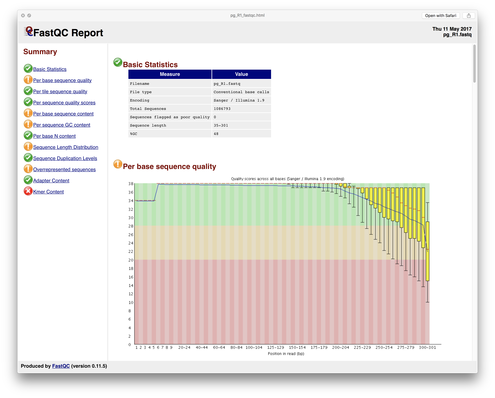
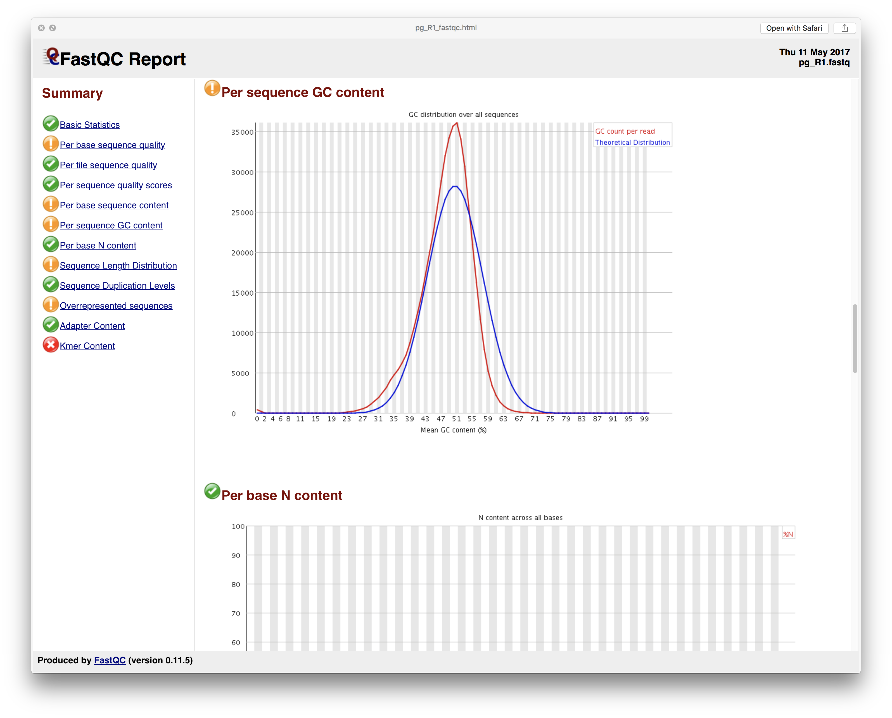
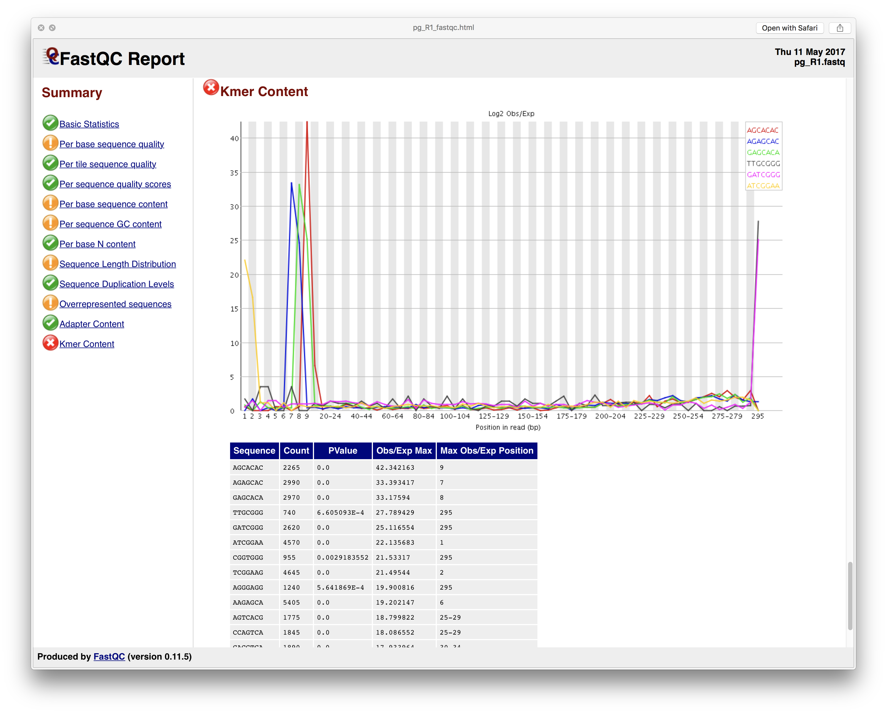
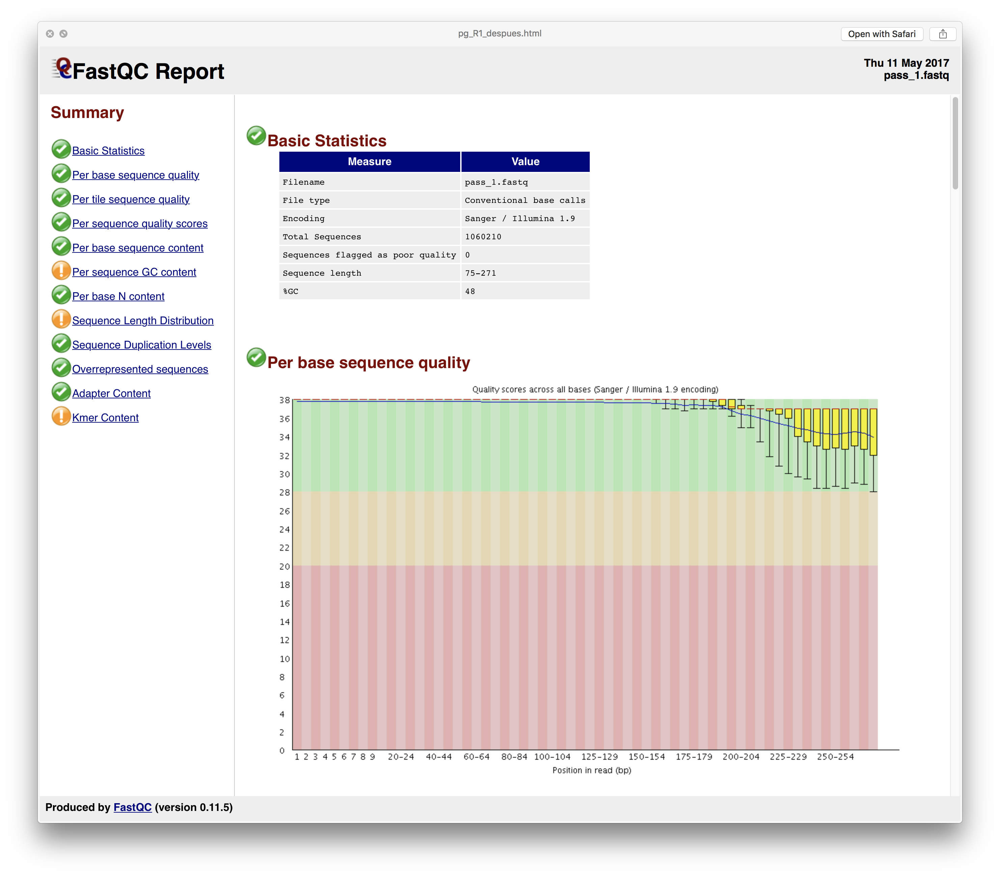
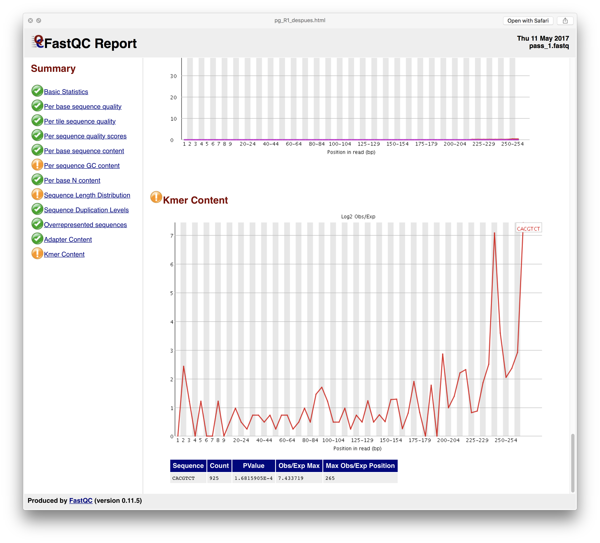
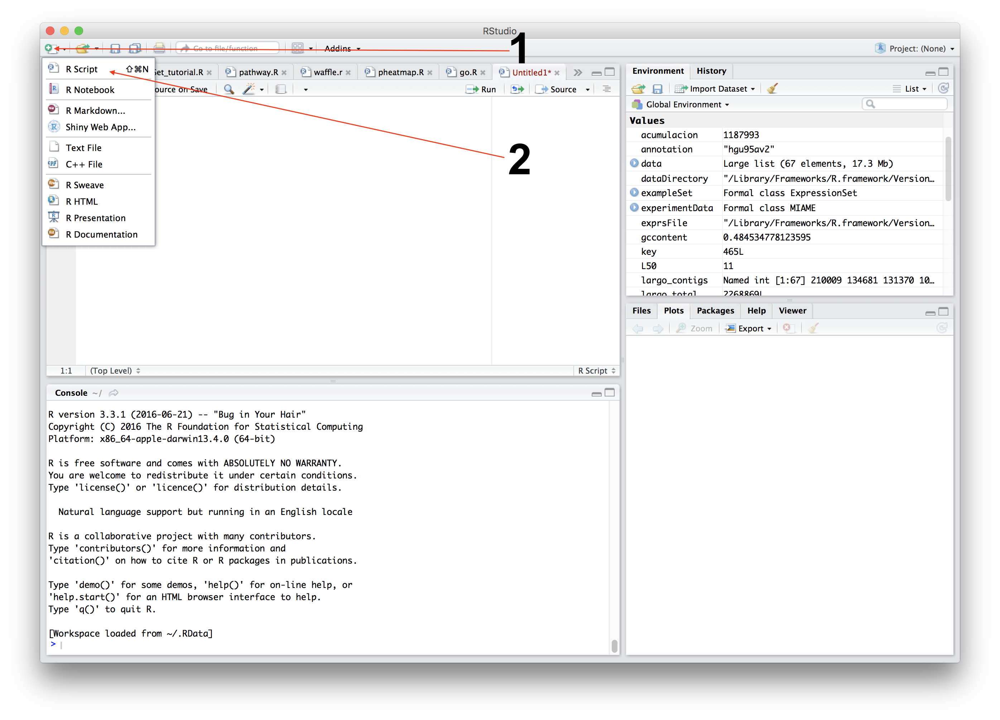
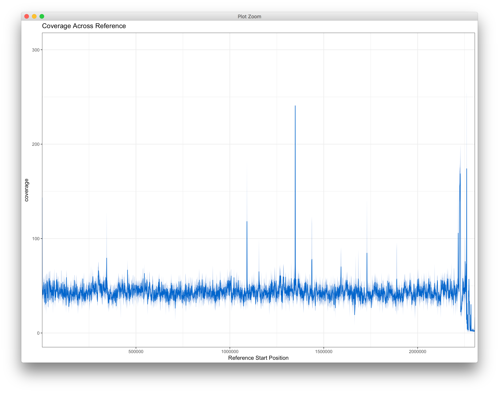
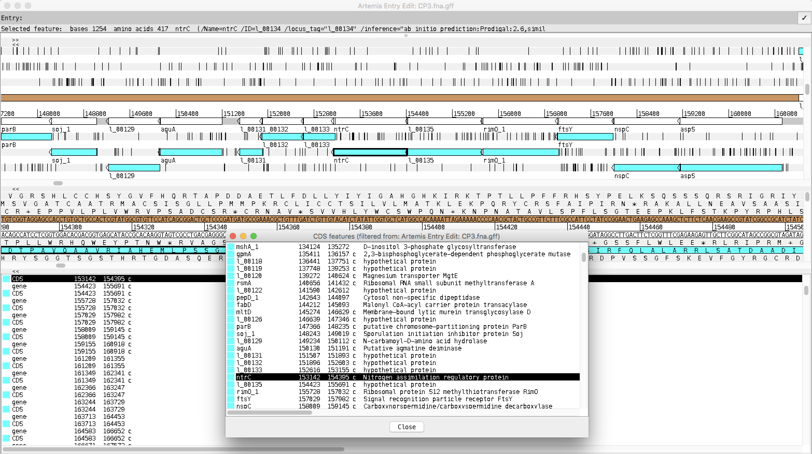

# Preprocesamiento de datos propios, Control de calidad. Análisis básicos en R
------

En este práctico aprenderemos los pasos esenciales que se deben realizar para obtener un buen ensamble, tanto si lo hacemos *denovo* o si utilizamos una *referencia*, a partir de lecturas de una secuenciación (**reads**). Se debe tener en cuenta que mientras más buena sea una secuenciación, mejor será su ensamble.

Requisitos:

* fastQC >= v0.11.5
* Prinseq-lite >= v0.20.4
* SPAdes >= v3.10.1
* Bowtie2 >= v2.2.9
* Samtools >= v1.3.1
* Bedtools >= v2.26.0
* Bcftools >= v1.3.1
* seqtk >= v1.0
* Prokka >= v1.12
* Artemis
* R >= v3.3.1
	* ggplot2
	* ape
* Reads: Si no tienes lecturas de secuenciación, puedes descargar las que se usan en este workshop [aquí](https://dl.dropboxusercontent.com/u/73361402/pg_reads_R1-R2.zip), son un set reducido de lecturas de una Porphyromonas gingivalis.

**Recomendación para el curso: siempre ten en cuenta donde estas ubicado en la terminal, así evitaras errores como "no such file or directory"**

### Paso 1: Revisar calidad de los reads

El primer paso (siempre), antes de trabajar con reads es obtener algunas estadísticas que nos dirán que tan bien resultó nuestra secuenciación, para esto usaremos FastQC, un programa escrito en java y que rápidamente nos puede otorgar estadísticas acerca del estado de nuestros reads.

	#crearemos una carpeta llamada paso1
	mkdir paso1
	#mueve tus secuencias a la carpeta paso1
	#puedes hacerlo arrastrando los archivos a la carpeta como una persona normal.
	#O puedes usar la terminal de tu computadora como los creadores del ramsomware que infectó a Movistar hace unos días.
	mv *.fastq paso1/.
	#Abrir fastQC
	File -> Open -> seleccionar pg_R1.fastq y pg_R2.fastq.

Aunque en este paso solo veremos algunas secciones del reporte, al final dejaremos el archivo disponible para que puedas descargarlo y analizarlo con mas tiempo. Ahora la principal ventana que nos interesa es la calidad que tiene nuestra secuenciación, y en general, una calidad (Q) sobre 20 se considera buena, ¿porqué?: El valor Q se define como una propiedad que está logaritmicamente relacionada con la probabilidad de que una base nucleotídica sea mal secuenciada, Q = -10log(P). Así, un valor Q   de 20 significaría un error de 1 base cada 100, dando una precisión del 99%. y viendo nuestro reporte, tenemos una buena secuenciación.



Otro aspecto que vale la pena revisar es el **%GC** (contenido Guanina-Citosina), un valor usado para clasificar organismos y en este caso para corroborar que lo que se secuenció sea efectivamente lo que queremos, para eso ambas curvas (teórica y real), deben ser similares y de un solo peak.

FastQC en este caso nos dice que hay algo malo con el contenido de Kmer (un Kmer se puede definir como todos los sub-read de nuestro read de largo definido y usado en diferentes aplicaciones. [Para ver mas información acerca de los Kmer pinche aquí](https://en.wikipedia.org/wiki/K-mer)).

Volviendo a lo nuestro, al principio y al final de nuestros reads se nota un aumento en la frecuencia de k-mers (errores de secuenciación?), este comportamiento es frecuente cuando se secuencia con tecnología illumina y puede ser corregido haciendo un pequeño corte en los extremos de las secuencias.


Para ver en detalle el reporte completo puedes descargarlo [aquí](https://github.com/microgenomics/Workshop-PUC/raw/master/dia2/paso1/pg_R1_antes.html.zip)

### Paso 2: Control de calidad
Para realizar las correcciones que observamos en el paso 1, usaremos "prinseq", un software open source escrito en perl famoso por su versatilidad en el manejo de reads.

Directo al grano
	
	#creamos una carpeta llamada paso2
	mkdir paso2
	#entramos en la carpeta
	cd paso2
	#y a continuación ejecutamos la línea de comando:
	prinseq-lite.pl -fastq ../paso1/pg_R1.fastq -fastq2 ../paso1/pg_R2.fastq -out_good pass -out_bad null -trim_left 10 -trim_right 20 -trim_qual_right 20 -min_len 75 -trim_qual_window 15  -trim_qual_step 5 -ns_max_n 0
	#salimos de la carpeta paso2
	cd ..

Donde:

* -fastq es el nombre del primer archivo fastq.
* -fastq2 es el nombre del segundo archivo fastq.
* -out\_good imprime solo las secuencias que pasan el control de calidad que se ha establecido.
* -out\_bad imprime las secuencias que no pasaron el control de calidad, como en este es null, no se imprimirán).
* -trim\_left corta N bases a la izquierda de la secuencia.
* -trim\_right corta N bases a la derecha de la secuencia
* -trim\_qual\_right corta bases a la derecha hasta que se encuentre con una calidad superior a la especificada.
* -min_len filtra las reads por un tamaño N
* -trim\_qual\_window es el numero de bases en los que se trabajará para revisar la calidad 
* -trim\_qual\_step cuantas bases avanzara la ventana de trim\_qual\_windows
* -ns\_max\_n número máximo de Ns permitidas.

Las reads que pasan el control de calidad, son puestas automáticamente en un nuevo archivo llamado **pass\_1.fastq, pass\_2.fastq, pass\_1\_singletons.fastq y pass\_2\_singletons.fastq**, pero a nosotros solo nos interesa los archivos que tengan las lecturas emparejadas, es decir: **pass\_1.fastq, pass\_2.fastq**.

Ahora podemos ver el estado de las reads que pasaron el filtro y compararlas con las del paso 1 haciendo una especie de fotografía  antes y después:

	Abrir fastQC.
	File -> Open -> seleccionar pass_1.fastq y pass_2.fastq

Vemos que el número de bases de mala calidad se ha reducido, tiene sentido ya que le dimos la instrucción a prinseq para cortar las reads que no cumplan con un valor Q=20.


El número anormal de kmers también desapareció con el tratamiento y aunque aun existe un tendencia en el aumento de frecuencia de estos al final del gráfico, el orden de magnitud fue ampliamente reducido en comparación con el "antes".


en otras palabras, hemos hecho el control de calidad (QC) a nuestras reads. Hurra!, si quieres revisar en detalle como resultó el proceso puedes descargar el archivo pinchando [aquí](https://github.com/microgenomics/Workshop-PUC/raw/master/dia2/paso2/pg_R1_despues.html.zip)

## Paso 3: Ensamble
Ya obtenidas nuestras reads de confianza, el siguiente paso es ensamblarlas. En simples palabras cuando se tienen reads ya procesadas, uno puede escoger entre 2 caminos para obtener un genoma, un ensamble **denovo** o un ensamble **con referencia**:

* **Denovo**: significa que nuestras reads se unieran entre ellas mediante overlapping, hasta formar un super gran read (o varios), que represente el genoma en cuestión.
* **Con referencia**: aquí nuestras reads se alinearán con algún genoma ya existente usándose como plantilla, obteniéndose un genoma con las mismas características estructurales de la plantilla (posición de genes, largo del genoma, etc).

### Paso 3.1: *Denovo*
Ensamblar un genoma *denovo* se refiere a la unión de todas las reads en un súper read muy largo llamado "Contig", y a su vez, estos contigs se tratan de unir en contigs aun mas largos llamados "scaffolds", todo esto con el fin de obtener el cromosoma completo de nuestro organismo.

**Recordatorio: nunca se obtendrá un solo scaffolds que represente todo el genoma circular de la bacteria (o algún otro organismo) a menos que sea secuenciada con mas de una tecnología o se usen diferentes librerías de secuenciación.**

Para esto usaremos un software llamado SPAdes, un software desarrollado en python que mediante gráficos de brujin (haciendo uso de kmers), ensambla nuestras reads. Debemos tener en cuenta que el proceso de ensamble requiere mucha memoria RAM, aproximadamente unos 8GB para pequeñas secuenciaciones, **es por esto que al final de este paso te damos el ensamble hecho!** :

	#crear carpeta paso3
	mkdir paso3
	#entrar en la carpeta
	cd paso3
	spades.py -1 ../paso2/pass_1.fastq -2 ../paso2/pass_2.fastq -t 4 -m 8 -o pg_assembly --careful --cov-cutoff auto
	
Donde: 

* -1 es la secuencia forward de nuestros reads.
* -2 es la secuencia reverse de nuestros reads
* -t es el número de hilos que la CPU de nuestro computador usará (si usted tiene un intel core i3 escriba: -t 4, si tiene un i5 o i7 escriba: -t 8)
* -m es la memoria RAM que especificamos a SPAdes
* -o es el output de nuestro ensamble (carpeta donde estarán los resultados
* --careful parámetro para reducir el número de reads mal ensambladas
* --cov-cutoff es un limite de coverage que aceptaremos, valores inferiores serán descartados
	
Una vez terminado el ensamble (alrededor de 30 minutos dependiendo del PC), nuestros scaffolds están en la carpeta pg_assembly (creada por SPAdes) en el archivo llamado scaffolds.fasta

aquí haremos una pequeña limpieza y eliminar todos aquellos contigs que tengan menos de 500 bases.

para ello ejecutaremos el siguiente comando:

	#entrar en la carpeta del ensamble
	cd pg_assembly
	awk 'BEGIN{RS=">";ORS=""}length($0)>500{print ">"$0}' scaffolds.fasta > filter500.fasta
	#salir de la carpeta del ensamble
	cd ..
	
Listo!, tenemos nuestro genoma ensamblado. Si no pudiste obtener tu ensamble por falta de recursos, puedes descargar el resultado de este paso pinchando [aquí](https://github.com/microgenomics/Workshop-PUC/raw/master/dia2/paso3/pg_assembly/filter500.fasta).


### Paso 3.2: Estadísticas básicas para un ensamble denovo

Ya solo nos queda evaluar que tan bien salió nuestro ensamble. Para esto utilizaremos Rstudio, una interfaz gráfica para el código R con el que manipularemos nuestro ensamble, esto mediante la librería "ape".


	#ingresamos a la carpeta paso3
	cd paso3

Ahora abre Rstudio y crea un nuevo R script.


copia y pega el siguiente código en tu hoja en blanco y sigamos pero ahora desde el script. Si llegaras a tener problemas con Rstudio, te dejamos el script [aquí](https://github.com/microgenomics/Workshop-PUC/raw/master/dia2/paso3/statistics.R) para que veas paso a paso.

```
library(ape)

#cambiamos la ruta de nuestro ensamble de acuerdo nuestro caso.
MyAssemblyPath<-"~/Desktop/Work-shop/paso3/pg_assembly/filter500.fasta"

myassembly<-read.dna(MyAssemblyPath,format = "fasta",as.character = T)

##################################################
#calcular el total de contigs de nuestro ensamble#
##################################################
total_contigs<-length(myassembly)
total_contigs #143
#En total son 143 contigs, un valor bueno si consideramos que nuestra muestra solo se ha secuenciado una sola vez (y es un set reducido).

######################################################
#calcular el largo total (en bp), de nuestro ensamble#
######################################################
#primero obtendremos el largo de cada uno de nuestros contigs
largo_contigs<-sapply(myassembly,function(x){length(x)})
#podemos graficar rápidamente como es la distribución del largo
plot(largo_contigs)
#y podemos guardar este gráfico en el botón Export del lado derecho de Rstudio, justo arriba del gráfico.
#ahora sumaremos todos los largos
largo_total<-sum(largo_contigs)
largo_total #2306476
#La cantidad total de bases también es buena en este caso, 2,306,476 (Total length) que se acerca mucho a los 2,354,886 que tiene el genoma de referencia de esta bacteria (Porphyromonas gingivalis ATCC 33277).


##################################
#calcular %GC de nuestro ensamble#
##################################
gccontent<-GC.content(as.DNAbin(myassembly))
gccontent #0.4819975
#El %GC de nuestro genoma también es un indicador que podemos usar para comprobar la similitud de nuestro genoma en este aspecto. 48.19% vs 48.4% (referencia) es muy bueno.

####################
#calcular valor N50#
####################
#N50 es un número estadístico que nos mide la calidad de un ensamble, se define como: Dado un numero X de contigs ordenados de mayor a menor, el N50 es el largo del contig cuya suma con los contigs anteriores se obtiene el 50% del largo total del genoma.
#de acuerdo a lo anterior, el primer paso sería ordenar los contigs de mayor a menor, pero SPAdes ya lo hizo por nosotros :D.
#el segundo paso es entonces obtener el 50% de nuestro genoma.
mitad<-largo_total/2
mitad #1153238

#el ultimo paso es ir sumando los contigs hasta obtener por lo menos el valor de 1153238 (mitad)
acumulacion<-0
for(N50 in largo_contigs){
  acumulacion<- acumulacion + N50
  if(acumulacion>=mitad){
    break
  }
}
N50 #77653
# En este caso, nuestro N50 sería: 77653. esta medida debemos complementarla con un valor L50, que nos dice cuantos contigs forman el N50.

####################
#calcular valor L50#
####################
acumulacion<-0
L50<-1
for(N50 in largo_contigs){
  acumulacion<- acumulacion + N50
  if(acumulacion>=mitad){
    break
  }
  L50<-L50+1
}
L50 #11

#En este caso 11 contigs componen el 50% del genoma, esto es bueno ya que tenemos al menos la mitad del genoma en unos pocos contigs.

```
Estas son solo algunas estadísticas básicas, también existen otras como el N90 (largo del contig cuya suma con el resto otorga el 90% del largo del genoma), L90 (suma de contigs que obtienen el N90), N's por cada 100kb, etc. Por el momento, estas son suficientes para concluir que tenemos un buen ensamble. Ya solo falta saber cuantas veces esta cubierto nuestro genoma.

### Paso 3.3: Ensamble con referencia
Ensamblar reads usando una referencia permite obtener un genoma tan bueno como lo sea la referencia, es decir, nuestras reads solo se acotaran al alineamiento de nuestra referencia y heredará algunas estadísticas básicas como el N50 y L50. Manos a la obra!

Lo primero es descargar un genoma de referencia, en nuestro caso, descargaremos el genoma de [Porphyromonas gingivalis ATCC 33277](https://github.com/microgenomics/Workshop-PUC/raw/master/dia2/paso3/pgRef.fna.zip) (y lo descomprimimos), si buscas otro genoma puedes consultar [la página web de NCBI](https://www.ncbi.nlm.nih.gov/genome/).

Este genoma de referencia posee las siguientes características:

* scaffolds: 1 
* N50: 2,354,886 
* L50: 1

Si nos fijamos, la referencia solo tiene 1 cromosoma, es decir, no está fragmentado como en el caso de nuestro ensamble *denovo*, te preguntarás entonces ¿Para que quiero obtener "otra vez" este genoma si ya esta completo? - La respuesta es que en tu secuenciación existen patrones que no están en la referencia, desde ese operon que hace super resistente a tu bacteria hasta ese SNP de diferencia que hace a tu bicho un blanco perfecto de vectores, después de todo, ¿tu organismo es especial por algo no?. Veamos que sale!

¿Recuerdan las reads filtradas del paso 2?, las alinearemos en el genoma de referencia, para esto usaremos Bowtie2, un alineador muy rápido y flexible (además de usar eficientemente la memoria), que como único requisito necesita el genoma indexado (convertido en un formato que bowtie2 pueda leer):

	#entramos en la carpeta
	cd paso3
	bowtie2-build --threads 4 pgRef.fna pgRef_index

Esto generará 6 archivos que representan el ensamble indexado para bowtie2. El siguiente paso es alinear los reads, de cualquier forma, si no lograste indexar el genoma por A B C motivos, pincha [aquí](https://github.com/microgenomics/Workshop-PUC/raw/master/dia2/paso3/pgRef_index.zip) para descargarlos y ponerlos en la carpeta paso3.

	#siguiente paso: alinear
	bowtie2 -x pgRef_index -1 ../paso2/pass_1.fastq -2 ../paso2/pass_2.fastq -S pg_ref.sam --end-to-end --very-sensitive --threads 4

Aquí uno tendería a pensar que todas nuestras reads se alinearon y si revisamos el output de bowtie2 nos daremos cuenta que esto no es así:

	243558 reads; of these:
	  243558 (100.00%) were paired; of these:
	    48202 (19.79%) aligned concordantly 0 times
	    184228 (75.64%) aligned concordantly exactly 1 time
	    11128 (4.57%) aligned concordantly >1 times
	    ----
	    48202 pairs aligned concordantly 0 times; of these:
	      8346 (17.31%) aligned discordantly 1 time
	    ----
	    39856 pairs aligned 0 times concordantly or discordantly; of these:
	      79712 mates make up the pairs; of these:
	        73841 (92.63%) aligned 0 times
	        4069 (5.10%) aligned exactly 1 time
	        1802 (2.26%) aligned >1 times
	84.84% overall alignment rate

Tenemos un 84.84% de reads alineadas (gran porcentaje por cierto), el resto probablemente pertenecen a contaminación (que es algo mas común de lo que se piensa), o quizás es alguna sección que no existe en el genoma de referencia y que si existe en el ensamble *denovo*, etc.

Bowtie2 nos dará como resultado un archivo SAM (Sequence Aligment Map) con toda la información del alineamiento, ([aquí puedes encontrar mas información acerca del formato SAM](https://samtools.github.io/hts-specs/SAMv1.pdf)). Al cual someteremos a una curiosa linea de código que nos dará solo los reads que han alineado con el genoma de referencia y de paso transformamos el formato a BAM para ahorrar espacio.

	samtools view -Sbh -F 0x4 --threads 4 pg_ref.sam |samtools sort -@4 > mapped_ref.bam

Donde:

* view es el modulo de samtools encargado de las operaciones con reads alineados.
* -Sbh son en realidad 3 parámetros (seria lo mismo escribir -S, -b, -h), la combinación de estos hace que el formato se cambie a .bam.
* -F 0x4 es un parámetro para decirle a samtools que solo tome en cuenta las reads alineadas.
* --threads es el número de hilos que utilizará samtools para trabajar (normalmente el numero de hilos a usar es el doble de los procesadores).
* sort es un modulo de samtools encargado de ordenar las reads de acuerdo a su posición en el alineamiento, o de acuerdo a su ID (-n para ordenar por nombre).
* -@ misma función que --threads.

Extraemos el consenso de las reads alineadas:
	
	samtools mpileup -E -uf pgRef.fna mapped_ref.bam |bcftools call -c - |vcfutils.pl vcf2fq > pg_consensus.fastq
	
Finalmente transformamos el formato fastq a fasta.

	seqtk seq -A pg_consensus.fastq > pg_consensus.fasta

	#salimos de la carpeta
	cd ..
	
Y voilà! tenemos nuestro genoma ensamblado con referencia (pg_consensus.fasta). Como las estadísticas básicas son heredadas por el genoma de referencia, no hace falta hacerlas de nuevo, esta vez veremos un termino más avanzado, y que sirve para ambos tipos de ensambles, hablamos del "Coverage". Si no pudiste llegar hasta este paso, te dejamos el resultado del consenso [aquí](https://github.com/microgenomics/Workshop-PUC/raw/master/dia2/paso3/pg_consensus.fasta)


## Paso 4: Obtención de coverage

El termino Coverage (Cobertura) se define como el número de reads que cubren una base, es decir número de veces que se ha secuenciado una base. Esta es una medida de calidad avanzada que nos dirá (dada la definición anterior), cuantas veces hemos secuenciado nuestro genoma.

### Paso 4.1: ***Denovo***
Parecido en el ensamble con referencia, alinearemos las reads filtradas en el paso 2 con nuestro genoma ensamblado para saber cuantas veces se ha cubierto con nuestras reads, volvemos a usar Bowtie2 para ello. Primero necesitamos indexar nuestro genoma:

	#primero crearemos una carpeta para este cuarto paso
	mkdir paso4
	#entramos en la carpeta
	cd paso4
	bowtie2-build --threads 4 ../paso3/pg_assembly/filter500.fasta pg_index

Esto generará 6 archivos que representan el ensamble indexado para bowtie2. El siguiente paso es alinear los reads, de cualquier forma, si no lograste indexar el genoma por A B C motivos, pincha [aquí](https://github.com/microgenomics/Workshop-PUC/raw/master/dia2/paso4/pg_index.zip) para descargarlos y ponerlos en la carpeta paso4

	bowtie2 -x pg_index -1 ../paso2/pass_1.fastq -2 ../paso2/pass_2.fastq -S pg.sam --end-to-end --very-sensitive --threads 4

Esto nos dará (igual que en el ensamble con referencia), un archivo SAM (Sequence Aligment Map), con toda la información del alineamiento, ([aquí puedes encontrar mas información acerca del formato SAM](https://samtools.github.io/hts-specs/SAMv1.pdf)). 

### Paso 4.2: **Con referencia**
En este caso, el alineamiento de reads ya está hecho, es el archivo SAM que obtuvimos al alinear las secuencias en contra del genoma de referencia (pg_ref.sam).  Por lo tanto nos hemos ahorrado este paso, Felicidades!

### Paso 4.3: Convergencia en los pasos
Si bien se trata de forma independiente los casos para ensamble *denovo* y con referencia, hay un punto en común que puede utilizarse independiente del método y es a partir del archivo SAM, así que escojamos uno y sigamos adelante!.

Por lo pronto, necesitamos transformar el formato SAM a BAM (Binary Aligment Map), seleccionaremos el archivo SAM del ensamble *denovo* para continuar:

	samtools view -b -S pg.sam |samtools sort -@16 > pg.bam
	#ahora obtenemos el coverage por bp usango el archivo BAM anterior y el ensamble denovo, si tu escogiste el otro método, entonces debes utilizar el correspondiente BAM, y el genoma de referencia (pgRef.fna).
	genomeCoverageBed -ibam pg.bam -g ../paso3/pg_assembly/filter500.fasta -d > all.txt

Donde:

* -ibam es el archivo BAM de input
* -g el genoma de referencia (el ensamble denovo o el genoma de referencia, según corresponda).
* -d reporta la profundidad para cada nucleótido.
* >all.txt tiene el coverage por nucleótido a lo largo de nuestro genoma. Si tuviste problemas para obtener el archivo, [haz click aquí para bajarlo.](https://github.com/microgenomics/Workshop-PUC/raw/master/dia2/paso4/all.txt.zip)

Ahora estamos listos para graficar!, para eso solo copia este feo pero útil código en Rstudio y ejecútalo (pero ajusta la primera línea para que la ruta al archivo all.txt sea la correcta).

	alltxtPath<-"paso4/all.txt"
	
	library(ggplot2)

	slidingwindowplot <- function(windowsize, inputseq) {
	  starts <- seq(1, length(inputseq)-windowsize, by = windowsize)
	  n <- length(starts)
	  chunkbps <- numeric(n)
	  chunkstats<- numeric(n)
	  for (i in 1:n){
	    chunk <- inputseq[starts[i]:(starts[i]+windowsize-1)] 
	    chunkmean <- mean(chunk)
	    chunkstdv<-sd(chunk)
	    chunkbps[i] <- chunkmean
	    chunkstats[i]<-chunkstdv
	  }
	  return(list(starts,chunkbps,chunkstats))
	}
	
	binSize<-1000
	maxy<-max(df$sd)+10
	column.types <- c("character", "numeric", "numeric")
	all.data <- read.csv(alltxtPath, header=FALSE, sep="\t",colClasses=column.types)
	myvector_all<-as.vector(as.matrix(all.data[3]))
	windowAll<-slidingwindowplot(binSize,myvector_all)
	df<-data.frame(windowAll[[1]],windowAll[[2]],windowAll[[3]])
	colname<-c("x","mean","sd")
	colnames(df)<-colname
	eb <- aes(ymax = mean + sd, ymin = mean - sd) 
	
	
	ggplot(data = df, aes(x = x, y = mean)) +
	  geom_line(colour="#0066CC",size=0.5) + 
	  geom_ribbon(eb, alpha=.5, colour=NA,fill="#0066CC")+
	  theme_bw()+xlab("Reference Start Position")+
	  ylab("coverage")+scale_x_continuous(expand = c(0,0))+
	  scale_y_continuous(limits = c(0, maxy))+
	  ggtitle("Coverage Across Reference")
	  
Esto dará como resultado el siguiente gráfico que puedes guardar en la pestaña Export en el cuadro de la derecha de Rstudio:

Como vemos, el coverage a lo largo del genoma es homogéneo salvo algunas zonas pequeñas, y de acuerdo a la definición de este, tenemos que nuestro genoma esta cubierto aproximadamente 50 veces, un muy buen resultado.

## Paso 5: Anotación de ensambles
El proceso de anotación de un genoma (o alguna secuencia), se refiere a localizar algún patron (o muchos), dentro de una secuencia y asignarle un significado cada una de esas secciones para ser interpretada por nosotros.

Ahora que sabemos que nuestro ensamble está bien (*denovo* o con referencia), el siguiente paso es obtener anotaciones de ellos usando "prokka". Prokka es un software de anotación de organismos procariotas muy rápido, aproximadamente le toma 10 minutos anotar un genoma de 4Mbp. Listo, ¿Como anotamos?

	#muy simple, primero creamos una carpeta llamada paso5
	mkdir paso5
	#entramos en la carpeta
	cd paso5
	#ejecutamos esta linea de código para invocar a prokka, (usaremos el ensamble denovo, tu puedes usar el que mas te guste :D).
	prokka ../paso3/pg_assembly/filter500.fasta --outdir pg_annot --prefix pg --addgenes --centre e --locustag l --evalue 1e-5 --cpus 2

Donde:

* --outdir es el nombre de la carpeta donde se guardaran nuestros resultados.
* --prefix es el prefijo que tendrán nuestros archivos.
* --addgenes es un parametro para decirle a prokka que encuentre genes en cada CDS (coding DNA sequence).
* --centre es un id para nuestra anotación
* --locustag es un prefijo para cada locus que prokka encuentre.
* --evalue es un valor de filtro para que los resultados encontrados no sean al azar (mientras mas cercano a 0 mas estricto).
* --cpus es el numero de procesadores que prokka usará.

Esto resultará en 11 archivos. No te preocupes, no los usaremos todos, solo te recordaremos que contienen.

| Extensión |	Descripción	| 
|:---------:|:------------:|
|.gff	|	Es el archivo maestro de la anotación, contiene tanto las secuencias como sus anotaciones.|
|.gbk (.gb)	|	Es el archivo Genbank estándar derivado del .gff, si el input de prokka fue un multi-FASTA, entonces el output sera un multi-Genbank.|
|.fna	|Es un archivo FASTA con los contigs (o secuencias), de entrada|
|.faa	|Es un FASTA de secuencias aminoacidicas traducidas de los CDS encontrados.|
|.ffn	|Es un FASTA con todos los transcritos (CDS, rRNA, tRNA, tmRNA, misc_RNA) predichos.|
|.sqn	|Es un archivo con formato ASN1 "Sequin" para subirlos a Genbank.|
|.fsa	|Es un FASTA de nucleótidos de los contigs usados como input, usado por "tbl2asn" para crear el archivo .sqn|
|.tbl	|Feature Table file, es usado por "tbl2asn" para crear el archivo .sqn|
|.err	|Es un archivo con anotaciones no aceptadas - es un reporte con discrepancias de acuerdo a NCBI.|
|.log	|Un archivo .log contiene todos los mensajes de prokka mientras se ejecuta.|
|.txt	|Es un archivo con estadistícas acerca de las anotaciones encontradas.|
|.tsv	|Tab-separated file of all features: locus_tag,ftype,gene,EC_number,product|

Puede que no estén todos los archivos, dependiendo de los parámetros con los que fue invocado prokka, aún así los archivos mas usados son: .fna, .ffn, .faa

veamos que estadísticas nos dice el archivo pg.txt

	organism: Genus species strain 
	contigs: 67
	bases: 2268869
	CDS: 1931
	tRNA: 47
	tmRNA: 1
	gene: 1979
	repeat_region: 3
	
prokka encontró en nuestros 67 contigs (archivo .fna), encontró 1931 CDS que podemos encontrar el archivo .faa, 1979 genes que los podemos encontrar en el archivo .ffn. si tienes problemas para obtener la anotación, descárgala pinchando [aquí](https://github.com/microgenomics/Workshop-PUC/raw/master/dia2/paso5/pg_annot.zip)

Finalmente podemos visualizar el .gbk con [Artemis](http://www.sanger.ac.uk/science/tools/artemis), un software de Sanger Institute, con el que gráficamente podemos ver el .gff **[click derecho en el gff -> abrir con Artemis]** y buscar algún gen específico, o alguna zona de nuestro interés en el genoma, etc.



Hurra!, hemos llegado al final de este tutorial, esperamos que te haya servido tanto como a nosotros!, recuerda que puedes consultarnos cualquier duda que tengas. No te pierdas el proximo tutorial acerca de **Fundamentos de técnicas de representación reducida del genoma**.